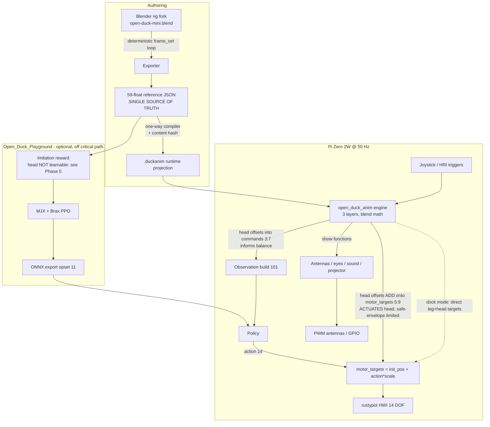
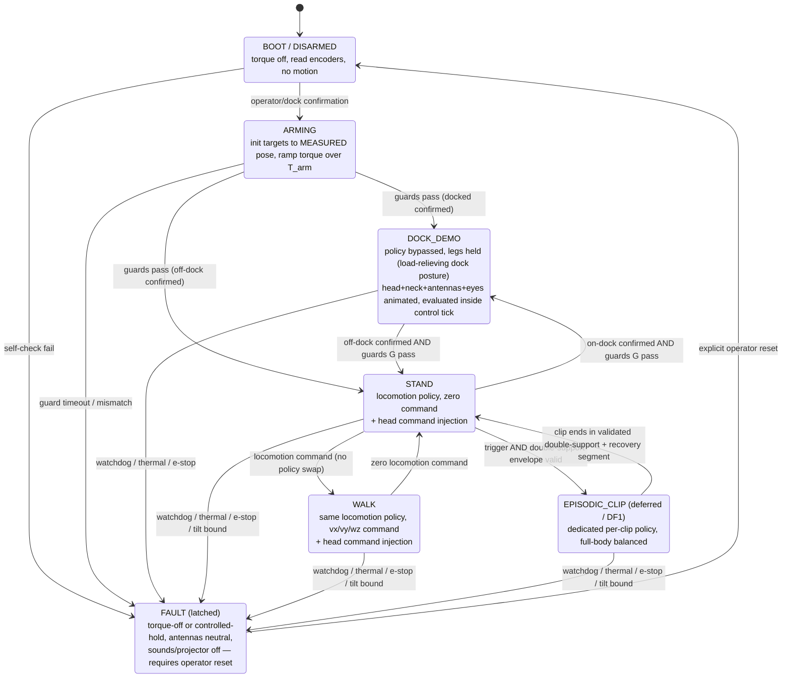

# Open Duck Mini v2 — Blender Animation & Sim2Real Design

Engineering design document. Status: proposed. Audience: implementing engineers and coordinating sub-agents.

## Table of contents

1. [Executive summary](#1-executive-summary) — [1.1 What we learned](#11-what-we-learned-for-whoever-picks-this-up-next)
2. [Goals and non-goals](#2-goals-and-non-goals) — incl. [Deferred / out-of-MVP](#deferred--out-of-mvp-discussed-not-deleted)
3. [Current-state analysis](#3-current-state-analysis) — [3.1.1 where the code lives](#311-where-the-code-lives-forks-and-branches)
4. [Target architecture](#4-target-architecture) — [4.3 Mode FSM](#43-mode-fsm)
5. [The `.duckanim` clip format spec](#5-the-duckanim-clip-format-spec)
6. [The animation engine spec](#6-the-animation-engine-spec) — [6.1 clock/orientation](#61-layers-clock-ownership-and-orientation), [6.2 capability matrix](#62-mode--channel-capability-matrix), [6.3 pose→command](#63-absolute-pose-to-relative-command-transform), [6.4 eval/output](#64-evaluation-and-output-contract), [6.5 safety](#65-safety-abort-e-stop-watchdog-and-thermal)
7. [Phased delivery plan](#7-phased-delivery-plan) — [Phase 0 spikes](#phase-0--de-risking-spikes-gates-run-first)
8. [Risk register](#8-risk-register)
9. [Open questions for the owner](#9-open-questions-for-the-owner)
10. [Appendices](#10-appendices)

---

## 1. Executive summary

We are building a Blender-authored animation pipeline for the Open Duck Mini v2 that runs on the physical robot (sim2real), and an on-robot animation engine that plays expressive animations in three ways:

- **Dock demo mode** — the robot sits on its dock, legs held still, and the head, neck, antennas and eyes are animated and "alive". No RL policy runs. This is the fastest path to a visible hardware result and ships first.
- **Blended/hybrid mode** — animations play on the head/neck/antennas while the RL policy keeps the legs balancing and walking. The animation actuates the head/neck through the additive path (the command channel informs balance but does not drive the head — see finding 3); the policy owns the legs entirely.
- **Episodic full-body mode** *(deferred / out-of-MVP)* — dedicated per-clip policies for full-body authored motions that must remain balanced. Discussed here for completeness but explicitly not part of the initial delivery.

The architecture mirrors Disney's BD-X animation system (Grandia et al., RSS 2024, arXiv:2501.05204): a portable core library implements the blend math once and is shared by the runtime, the training environment and the Blender exporter. The goal is **numerical compatibility within a stated tolerance** — pinned dependency versions plus golden test vectors — not bit-identical output, because NumPy is not bit-identical across x86 (Blender/desktop) and ARM (Pi Zero 2W) builds.

**Three headline findings shape this design:**

1. **A production Blender rig already exists.** `pollen-robotics/Open_Duck_Blender` (Apache-2.0) ships `open-duck-mini.blend` plus recording scripts. We fork and fix it rather than build a rig from scratch. It has **four** confirmed defects (antenna L/R index swap, hardcoded foot contacts, non-deterministic timer-driven recording, and baked ±10° knee/ankle offsets) that must be repaired — see [§3.4](#34-confirmed-defects-and-gaps).

2. **The `episodic`/`standing` training branch already exists.** `Open_Duck_Playground`'s `episodic` branch contains `EpisodicReferenceMotion`, an episodic task, and a `standing.py` "perpetual" policy with dedicated head tracking. This is the natural base for dock mode and stand-blend, and it means the hardest training scaffolding is already in place.

3. **The head is actuated additively by design — it was never meant to be learned by the walking policy.** This is the load-bearing conclusion of the project, established by measurement. Spike S0.1 first showed the deployed `BEST_WALK_ONNX_2.onnx` has DC gain ≈0 on all four head channels with the additive path removed. **Two subsequent 300M-step retrains then failed the same gate:** (i) Disney's leg/neck reward split trained healthily to peak reward 204.9 but measured gain ≈0 — because the reference motion is indexed only by locomotion velocity and gait phase, so the head *command* never reaches the reward target, and weighting the neck 100× merely pinned the head to the clip's nominal pose; (ii) redirecting the neck target to the command itself also failed (gain ≈0.007–0.034), with direct ONNX probing showing the policy emits ~0.05 of head action where ~4.0 is needed to track a unit command — **~80× too weak.** The head is a low-authority appendage whose marginal reward is buried under locomotion, domain-randomisation and push variance; PPO normalises advantages, so **no absolute weight can close the gap.** The evidence converges: the commented-out passthrough at `joystick.py:504`, the deployed additive path at `v2_rl_walk_mujoco.py:310-311` (measured gain 0.91–1.01), and `standing.py`'s head reward succeeding only with locomotion *off* all point the same way. **The additive path is the correct architecture, not a defect.** The command channel's role is to *inform the balance policy that the head is moving*, not to actuate it. See [§3.4 D1/D13](#34-confirmed-defects-and-gaps), [Phase 0/S0.1](#phase-0--de-risking-spikes-gates-run-first), [§7 Phase 5](#phase-5-optional--training-reward-experiments-completed) and [risk R11/R16](#8-risk-register).

**What this means for the plan.** The hybrid animated-head feature is **achievable today** via the additive path plus the safe envelope — it does **not** require retraining. Phase 5 is **off the critical path**; it is an optional improvement, not a prerequisite. The additive lines at `v2_rl_walk_mujoco.py:310-311` **must stay** — they are the actuation mechanism, not a latent double-count to be deleted. The binding constraint on expressiveness is **head-induced toppling (R16/D13)** and the safe operating envelope, not policy tracking.

**Phase 5 is now resolved — and it delivered.** Iteration 3 took the one lever that made sense once the head was understood as additively actuated: it drove the head passthrough *during* training (`motor_targets[5:9] = command[3:7] + motor_targets[5:9]`, mirroring `v2_rl_walk_mujoco.py:310-311` exactly) so the legs learned to balance while the head was driven through its full randomised command range. It did **not** make the head learnable — that was never possible — but it made the robot **robust to its head being driven**, which is what actually gates expressiveness. The result (300M steps, RTX 3090, ~1.5 h, reward starting at **11.7** and rising fast) is a genuine win: the **safe head envelope widened decisively** (`head_yaw` fully unlocked on its dangerous side, −0.29 → −1.50, ×5.2; `neck_pitch` −0.16 → −0.34 on the tight side, ~2×; combined L2 budget 0.55 → **1.0**), the exact deflections that previously toppled the robot (`head_yaw` −0.58 walking, `neck_pitch` +0.62 standing) now survive the **full trained range** with **no fall**, and **locomotion improved rather than regressed** (stand tilt **2.70°**, walk **3.85°** against a ~3° baseline, zero falls). We ship `passthrough_final_300M.onnx` (branch `feature/head-passthrough-training` @ `08536e1`) and keep the runtime's additive path **exactly as it is** — sim and deployment now match. Its acceptance was deliberately *redefined* away from the S0.1 head-tracking gain gate (meaningless under a passthrough, where gain ≈1.0 by construction) toward **envelope widening and no fall at full commanded deflection**. See [§7 Phase 5](#phase-5-optional--training-reward-experiments-completed).

### 1.1 What we learned (for whoever picks this up next)

A high training reward told us **nothing** about whether the head tracked its command. Iteration 1 reached a peak reward of 204.9 — a healthy, converged run — while the head's command-response gain was ≈0. The reward was maximised by holding the head *still* at its clip-nominal pose, which is exactly the wrong behaviour for an expressive head. Only a **direct, simulator-in-the-loop measurement gate (S0.1)** caught this — and it caught it **twice**, across two independent reward formulations. The generalisable lesson: for a low-authority DOF whose reward is dominated by other objectives, **do not trust training curves as evidence of the specific behaviour you want; measure the behaviour directly, end to end, against a quantitative threshold, before building on top of it.** Had we skipped S0.1 and trusted iteration 1's reward, we would have shipped a head that does not move and only discovered it on hardware. Two retrains (≈1.2 h each) were the price of *not* having believed the reward curve.

The lesson strengthened over three iterations, two of them failures. **Reward went *up* while the thing we cared about stayed at zero, twice** — and what finally worked (iteration 3) was **not** tuning the objective but **changing what the policy was exposed to during training**: driving the head passthrough so the legs experienced an externally-driven head. Two things are worth stating precisely for whoever picks this up next. First, the win was **not the metric we originally set out to move** (head command-tracking, which is unachievable by this policy) but the one that actually gated the product — the **safe operating envelope**. Second, **redefining the acceptance criterion mid-project was correct here**, because the original criterion (the S0.1 gain gate) had been *proven* to measure something unachievable; keeping it would have gated the product on an impossibility. Retiring a metric is legitimate only once you have hard evidence it measures the wrong thing — which is exactly what S0.1's two failures provided.

There is a sharper, more uncomfortable version of that second point. **The S0.1 gain gate (≥ 0.6 per channel) was not just measuring an untrainable behaviour — it was arithmetically unreachable by *any* policy**, because `tanh`-bounded actions times a single global `action_scale = 0.25` cap head deflection at ±0.25 rad, which caps achievable gain at 0.17–0.50 per channel (the table in [§7 Phase 0/S0.1](#phase-0--de-risking-spikes-gates-run-first)). A *perfect* tracker would have failed my gate. I set a pass/fail threshold without validating it against the system's physically expressible range, and it took a third-party ONNX probe to catch it. The generalisable rule: **before a threshold is allowed to gate expensive work, check that a perfect system could pass it** — derive it from the action space, actuator limits and command ranges, not from intuition. The upside is that the underlying measurement still held: the policy's head actions are command-invariant regardless of where the bar sits, so the architectural conclusion survived the error intact.

There is now a **third** instance of the same meta-lesson, and it is worth stating plainly: **we repeatedly diagnosed the wrong layer.** We spent two 300M-step runs shaping head-tracking *reward* when the problem was structural — the head command never reached the reward target — and four more episodic runs interrogating the *reward, phase encoding, terminations and then the reference file* when the real fault was **deeper in the training stack**: the PPO actor's action-distribution standard deviation running away (`policy_dist_max_std` to ~28,980) on an unbounded Gaussian policy head ([Phase 6](#phase-6-deferred--df1--episodic-full-body-clips--transitions); full evidence in [`episodic_standing_wiggle_findings.md`](episodic_standing_wiggle_findings.md)). In every case the training curve looked plausible (a converged 205 in one, a healthy +18.7 start in the other) and the fault sat **below where we were looking**. Two rules tie these episodes together: **(a) validate your inputs and verify a metric is physically achievable *before* spending GPU on it** (a reference-velocity validator and deriving the S0.1 threshold from the action space are cheap upstream checks); and **(b) instrument the training *internals*, not just the reward — `policy_dist_max_std`, entropy and `v_loss` told the real story here, and a declining reward alone sent us chasing the reference file for a fourth run.** *(Correction: an earlier version of this section, and R19, attributed the episodic failure to a self-contradictory reference; direct recomputation later showed the reference is velocity-consistent — see Phase 6.)*

---

## 2. Goals and non-goals

### Goals

- G1. A Blender → robot pipeline that exports authored clips deterministically and runs them on hardware.
- G2. A dock demo mode with no RL dependency, delivering expressive idle behaviour on the real robot.
- G3. A blended mode that animates head/neck/antennas while the RL policy walks/stands, actuating the head via the additive path (the command channel informs balance only — see [Decision A](#41-design-decisions-owner-approved-documented-not-relitigated)).
- G4. A portable, numpy-only core library whose blend math is **numerically compatible within a stated tolerance** across sim and the Pi Zero 2W (pinned deps + golden test vectors — not bit-identical, since NumPy differs across x86/ARM builds).
- G5. A **one-way compiler** from the authoring/training format (59-float reference JSON, the single source of truth) to a runtime O(1)-lookup projection (`.duckanim`), with content-hash provenance so a runtime clip is traceable to its source.
- G6. A mode FSM with safe, blended transitions that never hot-swaps policies mid-stride.
- G7. *(Optional, off critical path — now complete)* Training experiments to widen the head safe envelope; retrain; ONNX export. Not required for the hybrid feature; iteration 3 (head passthrough during training) **passed** and shipped `passthrough_final_300M.onnx` with a wider envelope — see [§7 Phase 5](#phase-5-optional--training-reward-experiments-completed).
- G8. Testing and CI for a repo that currently has neither.

### Non-goals

- N1. BVH/mocap retargeting — wrong joint model (ball joints vs 1-DOF revolute; backwards-bending knees). The rig's native IK subsumes it.
- N2. AMP/ASE adversarial imitation (`rimim/AWD`) — requires a second Isaac Gym system; ASE is non-functional per its own README; a direct tracking reward is easier to debug for a "put the head here" problem.
- N3. Latent-skill embeddings (ASE) — no clean artist-intent→latent-z mapping.
- N4. Animating legs during locomotion via naive post-hoc additive blending — destabilises a balancing biped. Deferred to residual RL if ever wanted.
- N5. Diffusion-based motion synthesis (RobotMDM) and trajectory-optimised kinematic animation (Animated Cassie) — noted as future work, out of scope.
- N6. Replacing the walking policy or the reference-motion gait generator.

### Deferred / out-of-MVP (discussed, not deleted)

The following are designed for and discussed in this document but are explicitly **not** part of the initial delivery. They are labelled at each point of use.

- DF1. **Per-clip episodic policies** (full-body balanced authored motion). Requires retraining per clip; gated behind the reward split and safe double-support validation. See [Phase 6](#7-phased-delivery-plan).
- DF2. **Live Blender streaming preview to the Pi.** Nice-to-have authoring convenience; safety-sensitive. See [Phase 7](#7-phased-delivery-plan).
- DF3. **Runtime root-orientation slerp.** No component of the runtime data contract carries a body quaternion, so orientation blending is unreachable in the initial engine and is dropped from it (see [§6.1](#61-layers-clock-ownership-and-orientation) / [S10 rationale](#64-evaluation-and-output-contract)). Retained in the design only as a documented extension point.

---

## 3. Current-state analysis

### 3.1 Ecosystem map

| Repo | Licence / branch | Role | Relevance |
|---|---|---|---|
| `apirrone/Open_Duck_Mini` (this repo) | pkg `mini-bdx` | Hub: CAD, BOM, docs, ONNX checkpoints (`BEST_WALK_ONNX_2.onnx` at root), legacy `mini_bdx/`, `experiments/` | Hosts the new `open_duck_anim/` core library. No test framework, no CI. |
| `apirrone/Open_Duck_Playground` | Apache-2.0; `main` + `episodic` | MJX + Brax PPO training, ONNX export | Reward split, episodic/standing policies |
| `apirrone/Open_Duck_Mini_Runtime` | branch `v2` | On-robot runtime (Pi Zero 2W) | Additive head actuation (permanent), safe envelope, FSM |
| `apirrone/Open_Duck_reference_motion_generator` | — | Placo gait → 59-float reference JSON → poly fit | Authoring/training format |
| `pollen-robotics/Open_Duck_Blender` | Apache-2.0; git-lfs | Blender rig + recording scripts | Exporter forked into `blender/` **in this repo** (not a separate fork); attribution preserved in `NOTICE`. Owner authors on **Blender 5.2.1 LTS** |
| `PaulTR/Open_Duck_Mini_Animator` | Apache-2.0 | Web keyframe animator + Flask `/read`,`/play` on Pi | Live-preview endpoints; standalone player reference |
| `rimim/AWD` | — | Isaac Gym AMP/ASE fork | Avoid (ASE non-functional) |

### 3.1.1 Where the code lives (forks and branches)

**Fork strategy (Q1, owner-decided):** all work lives on branches in the **owner's own forks**, not contributed upstream for now. The three training iterations were **all published deliberately — including the two that failed** — because this document cites them as the evidence for the head-actuation architecture (Decision A, [§7 Phase 5](#phase-5-optional--training-reward-experiments-completed)).

| Upstream repo | Owner fork | Branch(es) |
|---|---|---|
| `apirrone/Open_Duck_Mini` | `Clancey/Open_Duck_Mini` | `clancey-blender-animation-sim2real` (all 11 commits) |
| `apirrone/Open_Duck_Playground` | `Clancey/Open_Duck_Playground` *(newly created)* | `feature/leg-neck-reward-split` (iter 1, `3983a0e`); `feature/head-command-tracking` (iter 2, `13c246b`); `feature/head-passthrough-training` (iter 3, `08536e1` — produced the shipped policy) |
| `apirrone/Open_Duck_Mini_Runtime` | `Clancey/Open_Duck_Mini_Runtime` | `feature/animation-engine` (`cd88b70`, based on upstream `v2`) |
| `pollen-robotics/Open_Duck_Blender` | *(no fork)* | Exporter work lives in `blender/` inside `Clancey/Open_Duck_Mini`, Apache-2.0, upstream attribution in `NOTICE` |

**Push gotcha (bit us once, will bite again).** The owner's `GH_TOKEN` **lacks the `workflow` scope**, so HTTPS pushes are **rejected for any commit that touches `.github/workflows/`**. Push over **SSH** instead — `git@github.com:Clancey/<repo>.git` — for those commits (or for all of them, to avoid the trap).

### 3.2 Data path: CAD → ONNX → Pi

```
CAD / URDF / MJCF  ──►  Placo gait generator (FPS=50)  ──►  59-float reference JSON
                                                              │
                        Blender rig (author by hand)  ────────┤
                                                              ▼
                             Open_Duck_Playground (MJX/Brax PPO, imitation reward)
                                                              │  export_onnx.py (opset 11)
                                                              ▼
                                    ONNX policy  obs[1,101] → continuous_actions[1,14]
                                                              │
                                                              ▼
                     Open_Duck_Mini_Runtime  v2_rl_walk_mujoco.py @ 50 Hz on Pi Zero 2W
                                                              │
                                                              ▼
                       Feetech STS3215 (14 bus DOF) + PWM antennas + eyes/projector/sound
```

### 3.3 Data contracts (confirmed against source and the ONNX model)

- **Observation** length **101** (`v2_rl_walk_mujoco.py:152-170`): `gyro 3 | accelero 3 | cmds 7 | (dof_pos-init_pos) 14 | dof_vel*0.05 14 | last_action 14 | last_last_action 14 | last_last_last_action 14 | motor_targets 14 | feet_contacts 2 | imitation_phase 2`.
- **Command vector** length **7** (`:93`): `[vx, vy, wz, neck_pitch, head_pitch, head_yaw, head_roll]`. Head channels are indices 3..6.
- **Action** length **14**; `motor_targets = init_pos + action * action_scale` (`:290`), `action_scale=0.25`.
- **Reference frame** 59 floats (generator) → evaluated **40-dim** in the imitation pipeline `[16 pos | 16 vel | 2 contacts | 3 lin vel | 3 ang vel]`; only the 2-float phase `[cos,sin]` enters the policy obs, the full 40 goes to the critic only.
- **Joint orders**: reference uses a **16-joint** order (with antennas at indices 9,10); hardware uses a **14-DOF** bus order (no antennas). They differ *only* by the two antenna entries — see [Appendix A](#appendix-a-joint-tables-and-index-maps).

### 3.4 Confirmed defects and gaps

| # | Defect / gap | Location | Impact | Action |
|---|---|---|---|---|
| D1 | **CORRECT-BY-DESIGN (not a defect).** The additive head path was read as a "double-count"; measurement proved otherwise. S0.1 + two 300M-step retrains show the walking policy cannot learn head-command-following (gain ≈0; action authority ~80× too weak), so the additive path is the **intended actuation mechanism**. History preserved for provenance | `v2_rl_walk_mujoco.py:310-311` | None — required for head motion. The command channel *informs balance*; the additive path *actuates* the head | **Keep permanently.** Do not delete. Constrain only via the R16/D13 safe envelope |
| D2 | **Antenna L/R swapped**: index 9 gets `antenna.r`, canonical 9 = left | `data_recording.py:91-108` | Mirrored antennas | Fix in fork (Phase 2) |
| D3 | **Foot contacts hardcoded** `[1,1]` | `data_recording.py:150` | `w_contact` degenerate for Blender clips | Compute contacts or zero the weight for non-stepping clips (Phase 2) |
| D4 | **Recorder is wall-clock timer-driven** | `data_recording.py:191-193,225-226` | Dropped/duplicated frames on slow scenes | Rewrite as deterministic `frame_set()` loop (Phase 2) |
| D5 | Neck/head **excluded from the imitation reference/reward** | `custom_rewards.py:78-82`; `PolyReferenceMotion.get_reference_motion` indexed only by `cmd[0:3]`+phase | **Explanatory finding, not a fix target.** Confirms why the policy cannot learn head-command-following: the head command never reaches the reference. Weighting the neck (iter 1) or retargeting it to the command (iter 2) did not help | Leave as-is; the head is actuated additively (D1). Phase 5 iteration 3 used the passthrough (not a head reward) to widen the safe envelope |
| D6 | Broken `root_quat_slice_start=3` (indexes `left_knee`, not a quat) | `custom_rewards.py:44-45`, TODO `:33`, excluded `:135-144` | Latent bug | Do NOT reintroduce; keep out of summed reward |
| D7 | `max_motor_velocity=5.24` clip **commented out** | `v2_rl_walk_mujoco.py:292-298` | No runtime velocity guard | Re-enable on **final 14-DOF bus targets** in both sim and runtime (Phase 3 minimum set / Phase 7) |
| D8 | Low-pass action filter **disabled by default** (`--cutoff_frequency None`) | `v2_rl_walk_mujoco.py:37,300-306,381` | No smoothing | Choose cutoff below Nyquist (25 Hz) from a lag budget; enable identically in sim and runtime or neither (Phase 7) |
| D9 | Stale obs-length comments (`# 3`, `# 10`) | `joystick.py:570-588` | sim state 67 vs deployed 101 confusion | Reconcile carefully during integration (Phase 4/5) |
| D10 | No tests, no CI | this repo | Clips reach hardware unvalidated | pytest + Actions + MuJoCo replay harness (Phase 1a) |
| D11 | **Baked `±10°` knee/ankle offsets** hardcoded in exporter | `data_recording.py:91-108` (`np.deg2rad(10)`) | Silent joint zero/sign error; un-auditable calibration | Replace with an explicit calibrated zero/sign/axis transform table + regression test (Phase 2) |
| D12 | `37.5 Hz` low-pass constant is **above Nyquist** at a 50 Hz control rate | `joystick.py:202-204` | Aliasing / meaningless filtering if enabled as-is | Treat the constant as suspect; re-derive cutoff below 25 Hz (Phase 7, S6) |
| D13 | **Head-induced toppling at range extremes (S0.1 safety finding) — SUBSTANTIALLY MITIGATED by the iteration-3 passthrough retrain, not closed.** Step inputs at `neck_pitch`/`head_yaw` extremes previously fell the robot (tilt ≈179°, z<0) in stand and walk. After training with the head passthrough active, the exact deflections that toppled the old policy (`head_yaw` −0.58 walking, `neck_pitch` +0.62 standing) now survive the **full trained range** with no fall, and the measured safe envelope widened (`neck_pitch` −0.16→−0.34, `head_yaw` −0.29→−1.50 unlocked, combined budget 0.55→1.0) | `v2_rl_walk_mujoco.py:310-311` (additive actuation); `passthrough_final_300M.onnx` | Envelope is now wider but still bounded; **sim is not reality** — must be re-confirmed on hardware, with the ×0.5 first-trial derating (R16) | Enforce the widened envelope in `open_duck_anim` limits, **pinned to the passthrough checkpoint** (a policy change requires re-derivation); re-confirm on hardware before relying on the wider bounds |
| D14 | **Global (not per-joint) `action_scale` — a recorded divergence from Disney Appendix A, *not* a defect we are fixing.** Actions are `tanh`-bounded to [−1,1] and multiplied by a **single global 0.25** (`export_onnx.py:70-72`; `joystick.py:119,528-529`; `v2_rl_walk_mujoco.py:32,85,364`). With head `init_pos=0` this caps reachable head deflection at ±0.25 rad/channel, which is what made the S0.1 ≥0.6 gate unreachable | `joystick.py:119,528-529`; runtime `:32,85,364` | Bounds head expressible range regardless of policy; a per-joint scale could raise the head ceiling | **Do not change casually.** Blast radius (R18): changing `action_scale` **invalidates the deployed checkpoint and the pinned R16/D13 safety envelope**, and must change in **sim and runtime together**. Would raise the ceiling but not, on its own, fix tracking (credit assignment dominates) |

---

## 4. Target architecture

### 4.1 Design decisions (owner-approved; documented, not relitigated)

- **A. The head is actuated additively; the command channel informs balance; and training must include the passthrough so the two match (measured, not assumed).** `commands[3:7]` (neck_pitch, head_pitch, head_yaw, head_roll) is *in the observation* so the balance policy knows the head is moving — but it does **not** actuate the head. Head actuation is the additive/passthrough path at `v2_rl_walk_mujoco.py:310-311` (measured gain 0.91–1.01). This is the intended architecture, established by S0.1 plus two failed 300M-step retrains ([§7 Phase 5](#phase-5-optional--training-reward-experiments-completed)): the walking policy cannot learn head-command-following because the imitation reference is indexed only by locomotion velocity + gait phase (the head command never reaches the target, D5), and independently because head **action authority is ~80× too weak** — a unit command needs `action[7]≈4.0` but the policy emits ~0.05. That is a credit-assignment / signal-to-noise problem (the head's marginal reward is buried under locomotion and randomisation variance; PPO normalises advantages), so **no reward weight fixes it.** Corroborating evidence: the passthrough is deliberately commented out at `joystick.py:504`, and `standing.py`'s head reward works only with locomotion off. **Third clause (iteration 3, PASSED):** because the additive path is the actuation mechanism, the *training* environment must drive that same passthrough so the legs learn to balance under an externally-driven head — otherwise sim and the deployed runtime diverge and the safe envelope stays needlessly narrow. Training with the passthrough active widened the envelope decisively and improved locomotion (stand tilt 2.70°, walk 3.85°); we ship that checkpoint (`passthrough_final_300M.onnx`). **Why the command channel cannot be made to work without a whole-body reference generator (Disney §V-A, arXiv:2501.05204):** Disney's head command is not a reward target — it is an *argument to the reference generator*, `(x̂_t, φ̇_t) = f^peri(f_t, φ_t, g^peri_t)` (Eq. 3/6), and that generator is a whole-body IK/MPC solve (§V-A ¶7). A head command therefore perturbs the neck reference `q̂_n` **and** the torso/velocity/leg references `p̂, θ̂, v̂, ω̂, q̂_l` together, so the learning signal reaches the policy through the torso and leg reward terms, not only through a single neck term. §V-A ¶5 (verbatim): *"for periodic motion we assume the head commands to be offsets relative to a nominal head motion that the animator specifies as part of the periodic walk cycle."* Our iteration 2 redirected only the neck target — a strictly weaker signal — which is why it could not close the loop. (Note: Disney's §VII-B "Alternative RL Formulations" is a one-paragraph ablation of *gait specification* only; it never mentions the neck or command tracking and does **not** explain our failures — we did not miss a warning there.) Building a real `f^peri` that consumes head commands means building an IK/CoP solver — a multi-week cost — so **passthrough is the correct architecture, not merely expedient.** A cheap partial substitute is **head disturbance randomisation** (Disney Table V) — see the recommended improvement in [§7 Phase 5](#phase-5-optional--training-reward-experiments-completed). The authored `animation_delta` is applied through the additive path (transform in [§6.3](#63-absolute-pose-to-relative-command-transform)), clamped to the training ranges and to the R16/D13 safe envelope. This is **permanent, not interim** — the additive lines must never be deleted.
- **B. Portable core library.** New numpy-only package `open_duck_anim/` in this repo, imported by runtime, playground and the Blender exporter. No JAX, torch or scipy in the core, so it installs on a Pi Zero 2W. Blend math must be **numerically compatible within a stated tolerance** across sim and hardware — enforced by pinned dependency versions and golden test vectors, not by assuming bit-identical NumPy across x86/ARM.
- **C. One-way clip compiler.** Authoring/training = the existing 59-float reference JSON (the single source of truth, unchanged). Runtime = `.duckanim`, a **projection** produced by a one-way compiler that drops root pose/quaternion, toe positions, velocities and contacts. `.duckanim` cannot reconstruct a 59-float frame; any reverse direction is *partial extraction for inspection only*, never a round-trip. The compiler is deterministic (same input ⇒ byte-identical output) and stamps the source content hash, `.blend` name and frame range into `.duckanim` metadata. Both directions share one canonical `JOINT_ORDER_16 ↔ HW_ORDER_14` mapping module.
- **D. Three-layer engine** (Disney §VI-A): background loop → triggered clips → joystick additive offsets. `interp` (linear) for positions/joint angles. Body-**orientation slerp is deferred / out-of-MVP (DF3)**: the runtime carries no body quaternion, so the initial engine blends joint angles only. Asymmetric blends: **T_α = 0.35 s** (body), **T_β = 0.1 s** (show functions).
- **E. Layer masking with a capability matrix.** Under the RL policy, discard animated leg channels entirely; emit only head deltas + show functions. Animated legs only in dock mode (no policy) or a dedicated episodic policy. The precise legality per mode is the [mode × channel matrix](#62-mode--channel-capability-matrix); non-neutral values on disallowed channels are rejected at compile time, never silently dropped.
- **F. Mode FSM with safe startup and handoff.** Adds `BOOT/DISARMED`, `ARMING` and a latched `FAULT` state; transitions gated on quantitative guards (not the vague "near safe pose"); policy handoff prefers a single locomotion policy for STAND+WALK to avoid invalidating observation history. See [§4.3](#43-mode-fsm).
- **G. Training reward experiments are optional (Phase 5, off the critical path) — now resolved.** Two 300M-step retrains (leg/neck split; command-retargeted neck) both failed to teach head-command-following — see [§7 Phase 5](#phase-5-optional--training-reward-experiments-completed). The additive path (Decision A) is the actuation mechanism regardless. Iteration 3 then **passed** its (redefined) goal: driving the head passthrough during training *widened* the R16/D13 safe envelope and improved locomotion, without making the head learnable (which was never the objective). We ship that checkpoint; no further training is required for the feature.
- **H. Safety, abort and sim2real hardening** enabled in *both* sim and runtime or neither. A **minimum safety set** (abort, e-stop/deadman, watchdogs, thermal/load management) ships in the first hardware-touching phase, not deferred. See [§6.5](#65-safety-abort-e-stop-watchdog-and-thermal) and [Phase 3](#phase-3--dock-demo-on-hardware-first-hardware-touch).

### 4.2 Where the engine sits

The animation engine is a pre-policy stage that produces (i) four head offsets that are **both** written into `commands[3:7]` in the observation (so the balance policy knows the head is moving) **and** applied additively onto `motor_targets[5:9]` at `v2_rl_walk_mujoco.py:310-311` — the additive path is what actually actuates the head (Decision A) — and (ii) direct show-function outputs (antennas, eyes, sound, projector) that bypass the policy. In dock mode it additionally produces direct leg/head joint targets, bypassing the policy entirely.



### 4.3 Mode FSM

The FSM must have a safe startup path (never assume dockedness or a known pose), quantitative transition guards (not a vague "near safe pose"), a latched fault path, and a defined policy-handoff protocol. Note that swapping between two policies mid-operation invalidates the three action-history fields and the `motor_targets` history that are part of the 101-element observation (`v2_rl_walk_mujoco.py:152-170`), so the **preferred design is a single locomotion policy covering both STAND and WALK** (zero command = stand), which removes the handoff entirely.



**Startup.** The system boots into `BOOT/DISARMED` with torque off. `DOCK_DEMO` is entered only after explicit dock or operator confirmation — dockedness is never assumed.

**`ARMING`.** Read encoders; initialise all targets to the **measured** pose (never snap to `init_pos`); ramp torque and targets gradually to nominal over `T_arm` (proposed 1.0–2.0 s, tune on hardware). A guard timeout or a target/measured mismatch beyond tolerance routes to `FAULT`.

**Quantitative transition guards (guards G).** Replace "near safe pose" with all of:

| Guard | Proposed threshold (tune on hardware) |
|---|---|
| max joint position error vs target | ≤ 0.05 rad |
| max joint velocity | ≤ 0.5 rad/s |
| IMU tilt (roll/pitch from vertical) | ≤ 0.10 rad |
| foot contact state | as required by target mode (both feet for STAND) |
| dwell timeout | guard must hold for ≥ 0.3 s before transition fires |
| hysteresis | re-entry requires leaving the band by ≥ 20% to avoid chatter |

**Policy handoff.** Preferred: single locomotion policy for STAND+WALK — no handoff. If two policies are ever used, the incoming policy's action-history and `motor_targets` history fields must be **seeded from the outgoing policy's last emitted values** (not zeroed), and outputs crossfaded over N ≥ 10 ticks; this is called out as a risk (R6) because it is easy to get wrong.

**`FAULT` is latched** and requires explicit operator reset back to `BOOT`; it is never auto-cleared. Its torque-off vs controlled-hold policy is defined in [§6.5](#65-safety-abort-e-stop-watchdog-and-thermal).

### 4.4 Boundary data contracts (summary)

| Boundary | Vector | Length | Notes |
|---|---|---|---|
| Engine → observation | head offsets in `commands[3:7]` | 4 of 7 | relative to nominal |
| Observation → policy | `obs` | 101 | see §3.3 |
| Policy → targets | `continuous_actions` → `motor_targets` | 14 | `init_pos + action*0.25` |
| Reference JSON frame | flat floats | 59 | see [Appendix B](#appendix-b-59-float-authoring-frame-layout) |
| Evaluated reference | pos/vel/contacts/vels | 40 | critic only; phase `[cos,sin]` to actor |
| Reference joint order | 16-joint | 16 | antennas at 9,10 |
| Hardware bus order | 14-DOF | 14 | no antennas |
| Body orientation | — | 0 | **no quaternion in the runtime contract → orientation slerp is out-of-MVP (DF3)** |

---

## 5. The `.duckanim` clip format spec

### 5.1 Rationale

The runtime format is a pre-baked, O(1)-lookup subset. The Pi Zero 2W is already near its control budget (`v2_rl_walk_mujoco.py:321-328` prints "Policy control budget exceeded by …"), so **any animation evaluation must be O(lookup), never O(solve)**. The 59-float reference format stays the authoring/training **single source of truth**; `.duckanim` is a **one-way projection** compiled from it, retaining only the head/antenna/show-function subset needed at runtime. It deliberately drops root pose/quaternion, toe positions, velocities and contacts, so it is **not** reversible to a 59-float frame. Provenance is preserved by stamping the source content hash, `.blend` name and frame range into `.duckanim` metadata; any reverse path is partial extraction for inspection only.

### 5.2 Schema

```jsonc
{
  "format": "duckanim",
  "version": 1,
  "name": "curious_head_tilt",
  "fps": 50,
  "loop_mode": "wrap",            // "wrap" | "once" | "clamp"
  "frame_count": 120,
  "duration_s": 2.4,             // frame_count / fps; authoritative for phase advance
  "blend_in_s": 0.35,            // body blend T_alpha; REQUIRE blend_in + blend_out <= duration_s
  "blend_out_s": 0.35,
  "show_blend_in_s": 0.1,       // show-function blend T_beta
  "show_blend_out_s": 0.1,
  "layer_mask": "head",         // "head" | "antennas" | "legs" | "full_body"
  "priority": 10,               // higher wins; see arbitration in section 6.4
  "requires_mode": "stand",     // "dock" | "stand" | "walk" | "any"
  "provenance": {
    "source_sha256": "<hash of the 59-float source JSON>",
    "source_blend": "open-duck-mini.blend",
    "source_frame_range": [1, 120],
    "compiler_version": "open_duck_anim 0.1.0"
  },
  "joints": {
    // 16 channels, canonical JOINT_ORDER_16, radians. AUTHORING/TRAINING value only.
    // Antennas (indices 9,10) are present for training parity but the RUNTIME NEVER
    // reads antenna values from here — see show_functions and the precedence rule.
    "order": ["left_hip_yaw","left_hip_roll","left_hip_pitch","left_knee","left_ankle",
              "neck_pitch","head_pitch","head_yaw","head_roll",
              "left_antenna","right_antenna",
              "right_hip_yaw","right_hip_roll","right_hip_pitch","right_knee","right_ankle"],
    "frames": [[/* 16 floats */], /* ... frame_count rows ... */]
  },
  "show_functions": {
    // AUTHORITATIVE runtime antenna source, normalized [-1,1], per side.
    // Compiled from the radian antenna channels via the calibrated conversion below.
    "antenna_left":  [/* frame_count floats, normalized [-1,1] */],
    "antenna_right": [/* frame_count floats, normalized [-1,1] */],
    "eyes":          [/* frame_count ints, blink state 0/1 (discrete, not slewed) */],
    "events": [       // discrete, fire-once; NOT rate-limited as joint angles
      {"frame": 30, "type": "sound", "value": "curious.wav"},
      {"frame": 60, "type": "projector", "value": "on"}
    ]
  },
  "antenna_calibration": {       // per-side radians -> normalized [-1,1] mapping, from config
    "left":  {"sign": 1,  "rad_min": -0.6, "rad_max": 0.6},
    "right": {"sign": -1, "rad_min": -0.6, "rad_max": 0.6}
  }
}
```

Notes:

- **Antenna representation and precedence (single rule).** The **runtime reads antenna values only from `show_functions.antenna_left`/`antenna_right`** (normalised `[-1,1]`), never from the 16-joint array. The joint array keeps antennas in **radians** purely as the canonical authoring/training value. The compiler converts radians → normalised per side using `antenna_calibration` (applying `LEFT_SIGN=+1`, `RIGHT_SIGN=-1` and the documented `rad_min`/`rad_max` range from `antennas.py`; see the calibration procedure in [Appendix A](#appendix-a-joint-tables-and-index-maps)). This resolves the previous dual-representation ambiguity.
- **Channel legality.** For a `head`-masked clip the leg channels in `joints.frames` must be neutral (equal to the dock/nominal hold). Non-neutral values on channels disallowed by the clip's mask/mode (per the [capability matrix](#62-mode--channel-capability-matrix)) are **rejected at compile time** (or warned loudly), never silently dropped.
- **Blend validation.** The compiler asserts `blend_in_s + blend_out_s <= duration_s`; if the ramps would overlap, both are clamped so the clip reaches full weight for at least one frame (formula in [§6.4](#64-evaluation-and-output-contract)).
- `npz` is an allowed alternative container for large clips (same field names, arrays instead of nested lists), decoded once at load.

### 5.3 Worked example (abridged)

A 1.5 s (75-frame @ 50 fps) head tilt to +0.5 rad yaw with an antenna flick. The duration comfortably exceeds `blend_in_s + blend_out_s = 0.70 s`, satisfying the validation rule:

```jsonc
{
  "format": "duckanim", "version": 1, "name": "quick_tilt",
  "fps": 50, "loop_mode": "once", "frame_count": 75, "duration_s": 1.5,
  "blend_in_s": 0.35, "blend_out_s": 0.35,
  "show_blend_in_s": 0.1, "show_blend_out_s": 0.1,
  "layer_mask": "head", "priority": 5, "requires_mode": "any",
  "provenance": {"source_sha256": "…", "source_blend": "open-duck-mini.blend",
                 "source_frame_range": [1, 75], "compiler_version": "open_duck_anim 0.1.0"},
  "joints": {
    "order": ["...16..."],
    "frames": [
      [0,0,-0.63,1.368,-0.784, 0.0,0.0,0.0,0.0, 0.0,0.0, 0,0,0.635,1.379,-0.796],
      // ... head_yaw (index 7) ramps 0 -> 0.5 across frames ...
      [0,0,-0.63,1.368,-0.784, 0.0,0.0,0.5,0.0, 0.3,0.3, 0,0,0.635,1.379,-0.796]
    ]
  },
  "show_functions": {
    // normalized [-1,1], compiled from the radian antenna channels via antenna_calibration
    "antenna_left":  [0, 0.5, 1.0, 0.5, 0, "..."],
    "antenna_right": [0, 0.5, 1.0, 0.5, 0, "..."],
    "eyes": [], "events": []
  },
  "antenna_calibration": {"left": {"sign": 1, "rad_min": -0.6, "rad_max": 0.6},
                          "right": {"sign": -1, "rad_min": -0.6, "rad_max": 0.6}}
}
```

At runtime, only the head block (indices 5..8 of the 16-order) is converted to **relative command offsets** (transform in [§6.3](#63-absolute-pose-to-relative-command-transform)); the leg values must be neutral because `layer_mask="head"`; the antenna tracks are read from `show_functions`, never from the joint array.

### 5.4 The 59-float authoring format

See [Appendix B](#appendix-b-59-float-authoring-frame-layout) for the full frame layout. Key facts: `FPS=50`; quaternion at bytes 3:6 is **XYZW** (scipy `R.as_quat()`; the `qw,qx,qy,qz` comments in the generator are stale/wrong); 16-joint order per `poly_reference_motion.py:6-22`.

---

## 6. The animation engine spec

### 6.1 Layers, clock ownership and orientation

**Three additive layers** (Disney §VI-A):

1. **Background loop** — always-on idle: blinks, antenna idle, subtle breathing.
2. **Triggered clips** — a clip blended over the background with weight β for show functions and α for body:
   - `ν_bld = (1-β)·ν_bg + β·ν_trig` (Eq. 9, show functions)
   - `c_bld = interp(c_bg, c_trig, α)` (Eq. 10 — linear for positions/joint angles)
   - β and α ramp linearly 0→1 at clip start and 1→0 before clip end.
3. **Joystick layer** — mapped to **additive offsets** on the animated head pose (composition rule in [§6.3](#63-absolute-pose-to-relative-command-transform)). While walking, posture axes remap to velocity commands but gaze controls stay identical.

**Orientation slerp is dropped from the initial engine (DF3, per S10).** The runtime data contract carries no body quaternion (neither `.duckanim` nor `EngineOutput` has one), so body-orientation blending is unreachable. The engine blends joint angles only. No compute is budgeted and no tests are written for slerp; it is retained solely as a documented extension point (would require adding an explicit orientation channel plus a named consumer).

**Clock ownership and concurrency (S1).** The animation is evaluated **exactly once per policy/control tick, inside that tick, from one monotonic timestamp** — there is no separate 50 Hz animation timer (two nominally-50 Hz clocks would drift). Rules:

- Clip phase advances from **elapsed wall time** (`t_now − t_clip_start`), not by counting frames, so a dropped control cycle does not desynchronise the clip.
- Skipped-frame handling is defined: on an overrun the phase jumps to the correct time; any discrete `events` whose frames were crossed during the gap fire **exactly once**, in order.
- **One thread owns the actuator bus exclusively.** Triggers (HRI, joystick, network) arrive via a queue or atomic snapshot read at the top of the tick; no other thread writes targets.
- The 20 Hz command polling (`v2_rl_walk_mujoco.py:97`) must **not** quantise animation-driven head commands: the engine writes `commands[3:7]` every control tick (50 Hz) directly, bypassing the 20 Hz joystick poll path.

### 6.2 Mode × channel capability matrix

This matrix is the single authority for what a clip may drive in each mode (resolves the previous contradiction where a `head` clip was said to play full-body in dock mode). "Legs" here means the 10 leg DOF; "head" means `commands[3:7]` or the 4 head DOF; "show" means antennas/eyes/events.

| Mode | Legs | Head | Show functions | Notes |
|---|---|---|---|---|
| `DOCK_DEMO` | **held** (load-relieving dock hold; clips may NOT move legs) | direct joint targets | direct | A dock head-only clip always preserves the dock leg hold. Full-body dock motion is not permitted (stall/tip risk). |
| `STAND` | policy-owned (animation legs discarded) | command offsets `commands[3:7]` | direct | head + show only from animation |
| `WALK` | policy-owned (animation legs discarded) | command offsets `commands[3:7]` | direct | head + show only from animation |
| `EPISODIC_CLIP` *(DF1)* | policy-owned (clip is the policy's reference, not a direct target) | policy-owned | direct | full-body via a trained policy, never post-hoc |

A clip whose `layer_mask`/`requires_mode` would require moving a channel this matrix marks policy-owned or held is **rejected at compile time**. Legs are only ever *moved by animation* in a future full-body dock mode, which is out of scope.

### 6.3 Absolute pose to relative command transform

Authored clips store **absolute** head joint angles; the policy consumes **relative** command offsets. The transform is explicit:

```
animation_delta   = authored_head_pose[k] − authored_nominal_pose[k]      # per head channel k
command[3:7]      = base_command[3:7] + animation_delta + joystick_offset  # joystick composes additively
command[3:7]      = clamp(command[3:7], training_range)                    # then physical clamp below
```

- `authored_nominal_pose` is the clip's neutral head pose (typically all-zero head channels).
- The joystick layer composes as a further **additive** offset on the same four channels (gaze controls identical whether standing or walking).
- Clamp to the **training command ranges** first — `neck_pitch [-0.34,1.1]`, `head_pitch [-0.78,0.78]`, `head_yaw [-1.5,1.5]`, `head_roll [-0.5,0.5]` (`joystick.py:94-101`) — because commands outside the trained range produce undefined policy behaviour. Then clamp to physical joint limits (MJCF `jnt_range`). The tighter of the two governs.

**Permanent wiring.** The policy does not track `commands[3:7]` and cannot be trained to (S0.1 + two failed retrains, [§7 Phase 5](#phase-5-optional--training-reward-experiments-completed)), so the `animation_delta` is **always** applied through the **additive head path** (`v2_rl_walk_mujoco.py:310-311`) — the actuation mechanism (Decision A) — never through the command channel. The `commands[3:7]` values are still written into the observation so the balance policy knows the head is moving. The `open_duck_anim` transform computes and clamps the delta (to the training ranges *and* the R16/D13 safe operating envelope — max deflection and max slew per channel) and the runtime routes it additively. This is not staged or interim; the additive lines must not be deleted. **The shipped policy is trained with this same passthrough active** (`passthrough_final_300M.onnx`, iteration 3), so sim and runtime actuate the head identically; the envelope clamps are those measured against that checkpoint (see [§6.5](#65-safety-abort-e-stop-watchdog-and-thermal)) and are only valid for it.

### 6.4 Evaluation and output contract

```python
def evaluate(self, t_now: float, mode: Mode, trigger_snapshot: Triggers) -> EngineOutput:
    """Pure, O(1)-lookup. numpy only. No solving, no allocation in the hot path.
    Called exactly once per control tick with a monotonic t_now (see 6.1).

    Returns:
      EngineOutput(
        head_command_offsets: np.ndarray[4],       # written to commands[3:7] (informs balance) AND added onto motor_targets[5:9] (actuates head); see 6.3
        show:                 ShowOutput,           # antenna_l, antenna_r in [-1,1], eyes, events
        leg_targets:          Optional[np.ndarray[10]],  # DOCK_DEMO only (held/neutral), else None
        head_targets:         Optional[np.ndarray[4]],   # DOCK_DEMO only, else None
      )
    """
```

- **Frame lookup / phase:** `frame = clip.frame_at_time(t_now − t_clip_start)` using elapsed time; optional linear interp between adjacent frames is O(1). No solving.
- **Blend-weight clamp formula:** with clip duration `D`, if `blend_in + blend_out > D` both are scaled by `D / (blend_in + blend_out) − ε` so the clip reaches α=1 for ≥1 frame. The compiler rejects clips needing this only if `D` is below one frame.
- **Triggered-clip arbitration (S4):** at most one triggered clip owns the head/show layer at a time. `priority` (higher wins) decides which trigger takes ownership; a higher-priority trigger **preempts** the current clip, and its blend-in starts from the **current blended output** (not from the background layer), so there is no visible snap. Equal priority: the newer trigger wins. When a clip ends or is preempted it blends back to the background/owning controller over its `blend_out` (T_α / T_β).
- **Rate limiting is applied to the final 14-DOF bus targets (S5), not here.** The engine may pre-smooth, but the authoritative `max_motor_velocity = 5.24` rad/s clip is applied **after** policy-vs-direct-mode selection, on the actual bus targets — limiting an animation *command* does not constrain what the policy emits. Antennas get a **separate normalised slew limit** (rad/s-equivalent on the `[-1,1]` track). Discrete `events` (eyes, sounds, projector) are **never** rate-limited as joint angles — they fire as state changes.
- All joint outputs are clamped to MJCF `jnt_range`; head commands are additionally clamped to the training ranges ([§6.3](#63-absolute-pose-to-relative-command-transform)).

### 6.5 Safety, abort, e-stop, watchdog and thermal

A **minimum safety set ships in Phase 3** (the first hardware-touching phase), because Phase 3 already moves real hardware. The prior claim that open-loop antennas are "safe to animate freely" is **withdrawn**: stalled hobby servos overheat, and holding legs statically under torque on the dock can stall bus servos.

- **(a) Controlled clip abort.** Cancelling a clip cancels its pending `events` and blends head/show outputs back to the owning controller over `T_α` (body) / `T_β` (show) — never an instantaneous cut.
- **(b) Deadman / e-stop.** A latched transition to `FAULT`. Policy defined: torque-off *or* controlled-hold (owner decision, [Q6](#9-open-questions-for-the-owner)); antenna PWM driven to neutral or disabled; sounds and projector shut down. Latched — requires explicit operator reset.
- **(c) Watchdogs.** (i) Control-loop deadline-miss watchdog — if a tick overruns its 20 ms budget beyond a tolerance/percentile, count and, past a threshold, fault. (ii) Stale-command / lost-controller timeout — if no trigger/heartbeat within a timeout, fall back to background idle and, if persistent, fault.
- **(d) Thermal and load management.** Read Feetech temperature/current where the bus exposes them; define per-servo limits; define a **maximum continuous demo duration** and a **cooldown policy**; use a **dock posture that mechanically relieves servo load** (rest against the dock) rather than holding pose under torque. Antenna duty is capped to avoid stall-hold.
- **(e) Head safe operating envelope (R16/D13).** Per-channel deflection limits and a combined L2 budget bound how far the additive path may drive the head so it cannot reach the toppling extremes, enforced in `open_duck_anim` limits. **The envelope is re-derived per policy** — it is only valid for the checkpoint that produced it — and the current values are pinned to the iteration-3 passthrough policy (`passthrough_final_300M.onnx`), which widened them decisively over the baseline:

  | channel | old (baseline policy) | new (passthrough policy) | change |
  |---|---|---|---|
  | `neck_pitch` | (−0.16, +0.31) | (−0.34, +0.355) | −side ~2×, +side +14% |
  | `head_pitch` | (−0.78, +0.78) | unchanged | full range |
  | `head_yaw` | (−0.29, +1.50) | (−1.50, +1.50) | −side **unlocked**, ×5.2 |
  | `head_roll` | (−0.50, +0.50) | unchanged | full range |
  | `COMBINED_L2_BUDGET` | 0.55 | **1.0** | ×1.8 |

  These constants land in `open_duck_anim/envelope.py` in a **separate commit** (authored concurrently — not part of this document change). A future policy change **requires re-derivation** with the same first-onset fine-sweep methodology (additive mode, governing across stand and walk). Sim is not reality: the ×0.5 hardware derating (R16) still applies for first hardware trials even under the wider bounds.

### 6.6 Timing and blend constants

| Constant | Value | Applies to | Source / note |
|---|---|---|---|
| `ctrl_dt` | 0.02 s (50 Hz) | policy + engine tick (single clock) | `joystick.py:49-60` |
| `T_α` (body) | 0.35 s | joint-angle / position blends | Disney §VI-A |
| `T_β` (show) | 0.1 s | antenna/eye/show-function blends | Disney §VI-A |
| low-pass cutoff | **TBD, must be < 25 Hz (Nyquist)** | first-order hold bridge | see below |
| `command_freq` | 20 Hz | joystick command polling | `v2_rl_walk_mujoco.py:97` (bypassed for animation head commands, §6.1) |

Face blends faster than body (T_β < T_α) so expression changes feel snappy while posture changes stay smooth.

**Low-pass cutoff caveat (S6).** Disney's 37.5 Hz cutoff was chosen for a **600 Hz** actuator bus, not a 50 Hz control loop. At 50 Hz the Nyquist frequency is **25 Hz**, so a 37.5 Hz cutoff is meaningless (above Nyquist) — the `37.5` constant in `joystick.py:202-204` is **suspect at this rate** (D12) and must not be enabled blindly. Select the cutoff **below 25 Hz** from an explicit lag/attenuation budget, verify it on the measured discrete response, and enable the **identical** filter in sim and runtime or in neither.

### 6.7 Per-tick compute budget (Pi Zero 2W)

Target: the engine adds well under 1 ms per 20 ms tick. Work per tick is: one elapsed-time→frame computation, ≤2 array lookups (background + triggered), one linear blend over ≤16 floats, and ≤4 clamp/rate-limit passes over ≤16 floats. **No slerp** (dropped, §6.1). This is O(channels) arithmetic — no matrix solves, no polynomial fits at runtime. The reference generator's polynomial fit and any solving happen offline; runtime is lookup only (Disney §V-A: reference generators are densely sampled and looked up by interpolation, never solved online). The engine must not allocate in the hot path; preallocate buffers at clip load. **Spike S0.2 measures this on real hardware before it is relied upon.**

---

## 7. Phased delivery plan

The plan front-loads **risk** (three spikes first), then the dock demo (fastest visible hardware result). Spike S0.1 and two follow-up retrains established that the head is actuated additively by design (Decision A), so the hybrid feature ships **without** retraining: Phase 4 is on the critical path, while Phase 5 (training experiments) and Phase 6 (deferred full-body) sit off the main line. Acceptance criteria are stated as objective thresholds (proposed; tune on hardware) rather than adjectives.

**Ordering note.** The test harness needs the clip format, so the format and core library (Phase 1) precede the harness (Phase 1a); the harness is not a standalone Phase 0. Phase 3 is only independent of Phase 2 if the first dock clip is **hand-authored `.duckanim`/JSON**; an end-to-end *Blender-authored* dock clip requires Phase 2.

### Phase 0 — De-risking spikes (gates, run first)

- **Objective:** Kill the three assumptions that could invalidate later phases.
- **S0.1 — Current-ONNX head command response characterisation (gates the D1 decision). ✅ EXECUTED 2026-09-01 — RESULT: FAIL (policy does not track head commands).** In a validated MuJoCo closed loop (50 Hz, `sim_dt=0.002`, decimation 10, `action_scale=0.25`, obs `[1,101]`→`[1,14]`; zero-command sanity passed — stands stably, tilt ≤5.6°, z≈0.16, no falls), `commands[3:7]` were swept against the current `BEST_WALK_ONNX_2.onnx` with the additive lines `:310-311` removed (`policy_only` mode). **DC gain (Δjoint/Δcommand) on the diagonal channel:**

  | Channel | policy_only stand | policy_only walk | additive stand | additive walk |
  |---|---|---|---|---|
  | neck_pitch | +0.0001 | −0.0029 | 0.923 | 1.003 |
  | head_pitch | −0.0038 | −0.0117 | 1.079 | 1.085 |
  | head_yaw | +0.0014 | +0.0022 | 1.058 | 1.049 |
  | head_roll | +0.0016 | +0.0034 | 0.970 | 1.040 |

  Sinusoid (0.5/1.0 Hz) `policy_only` attenuation ≈0.00 (a flat line against a full-range command); `additive` ≈1.0–1.26 with ~7°/15° phase lag. Cross-coupling: `policy_only` meaningless (diagonal and off-diagonal slopes both ≈0, all ≤0.012); `additive` ≤0.11 except neck_pitch/stand at 0.253. **Verdict:** `policy_only` FAILS both thresholds (gain ≥ 0.6, cross ≤ 0.2) on all four channels, standing and walking — gain is ≈0, ~500× under threshold. *(Methodological caveat, recorded below: the `≥ 0.6` gate was itself **arithmetically unreachable** — a perfect tracker would also have failed it. The ≈0 result is nonetheless a genuine, independent policy property.)* The `additive` cross-check on the *same* harness yields gain ≈1.0, proving the command is wired correctly and that ≈0 is a genuine policy property, not a harness artefact. **New safety finding (D13):** in `additive` mode, step inputs at `neck_pitch`/`head_yaw` range extremes topple the robot (tilt ≈179°, z<0) in both stand and walk, while `policy_only` perturbs the legs ≤0.02 rad and never falls. **Re-runnable harness:** `experiments/animation/spike_s01_head_response.py` (`--onnx --mode {policy_only,additive} --condition {stand,walk} --all`).
- **S0.1-R1 / S0.1-R2 — retrain gate re-measurements. ✅ EXECUTED 2026-09-02 — both FAIL (see [§7 Phase 5](#phase-5-optional--training-reward-experiments-completed) for full detail).** Iteration 1 (Disney leg/neck split, 300M steps, peak reward 204.9): gain ≈0 on both the 300M and peak-193M checkpoints, stand and walk — indistinguishable from baseline, because the imitation reference is indexed only by `cmd[0:3]`+phase so the head command never reaches the target (D5). Iteration 2 (neck target retargeted to `command[3:7]`, unit-tested, 300M steps, depressed peak reward 29): gain ≈0.007–0.034; direct ONNX probing (bypassing the sim) shows head action authority ~80× too weak (~0.05 vs the ~4.0 needed) — later decomposed into a ~4–6× units/`action_scale` ceiling plus a **dominant credit-assignment gap** (saturation was probed and refuted as the cause, below). **Conclusion:** the `policy_only` gain threshold is only meaningful for a *learned* head; it is **retired as a gate** for the additive/passthrough architecture (which S0.1 already validated at gain ≈1.0). It is retained only as the acceptance re-measure *inside* Phase 5's optional experiments.
- **⚠ S0.1 threshold error — recorded honestly (the gate was arithmetically unreachable).** The S0.1 gate of **DC gain ≥ 0.6 per head channel was impossible to satisfy by construction**, independent of policy quality. The exported policy outputs `tanh(loc)`, bounding actions to **[−1, 1]** (`playground/common/export_onnx.py:70-72`); `action_scale` is a **single global scalar 0.25** (`joystick.py:119,528-529`; runtime `v2_rl_walk_mujoco.py:32,85,364`), never per-joint; head `init_pos = 0`, so the reachable head deflection is **±0.25 rad on every channel**. The maximum achievable *average* gain against the trained command ranges is therefore:

  | channel | \|cmd\| max | action needed to track | max achievable gain | ≥ 0.6? |
  |---|---|---|---|---|
  | neck_pitch | 1.10 | 4.4 | 0.347 | no |
  | head_pitch | 0.78 | 3.1 | 0.321 | no |
  | head_yaw | 1.50 | 6.0 | 0.167 | no |
  | head_roll | 0.50 | 2.0 | 0.500 | no |

  **A perfect tracker at maximum authority would have failed this gate on all four channels.** The criterion should have been derived from the action-space arithmetic, not assumed. This does **not** overturn the measured finding — the policy genuinely does not track head commands (next bullet) — it is an *independent* methodological error. Any future gain-style threshold must be sanity-checked against what the action space can physically express **before** a training run is spent on it. (Lesson folded into [§1.1](#11-what-we-learned-for-whoever-picks-this-up-next); the global-`action_scale` divergence is recorded as D14/R18.)
- **Saturation hypothesis REFUTED — credit assignment remains the dominant cause.** It is tempting to blame the whole ~80× deficit on that units/saturation ceiling. A targeted ONNX probe refutes saturation as the dominant cause: head **action slope vs head command is ≈0.005–0.10** across all four channels (a gain of 0.6 needs slope ~2.4) — the actions are **command-invariant** (flat, near zero, with unused swing), *not* rising-and-clipping as saturation would show; that clipping signature is **absent** in every checkpoint tested (iter 1, iter 2, and the deployed passthrough). Control test proving the probe is valid: the same policies respond strongly to the `vx` locomotion command (slope 0.67–3.1) — they read command channels fine and specifically ignore the *head* command. Observation normalisation is not the binding constraint either — the head-command channels carry the **highest first-layer weight norm** of any input group (mean W_L2 = 6.4 vs ~3.4 for proprioception): the network sees the command clearly and still doesn't act on it. **Net:** the units ceiling accounts for ~4–6× of the deficit; **credit assignment / signal-to-noise accounts for the rest and dominates.** Fixing `action_scale` alone would raise the ceiling but would **not** produce head tracking. Architectural conclusion unchanged: **passthrough remains correct** and Phase 5 stays off the critical path.
- **S0.2 — Pi Zero 2W engine timing/compute profile.** Run the Phase 1 engine hot path on-device; measure added per-tick time and control-loop deadline-miss rate. **Pass:** engine adds < 1 ms/tick median and does not raise the existing budget-exceed rate (`:321-328`) at p99.
- **S0.3 — Dock mechanical / load / thermal validation.** With the robot on the physical dock, hold the intended dock posture and measure bus-servo current/temperature over a timed soak. **Pass:** no servo exceeds its thermal limit over the target continuous demo duration in a load-relieving posture.
- **Repos/files:** `experiments/animation/spike_s01_head_response.py` (S0.1, committed) + throwaway scripts in `Open_Duck_Mini_Runtime`; MuJoCo model.
- **Acceptance:** each spike returns a documented pass/fail against its threshold. **S0.1 + two retrain re-measures: DONE — head not learnable; folded into Decisions A/G, §6.3, Phases 4/5 and risks R11/R16. The additive architecture is confirmed and Phase 4 needs no retrain.** S0.2 and S0.3 pending.
- **Effort:** S each. **Dependencies:** S0.2 needs a Phase 1 prototype. **Parallelizable:** S0.1 (done) and S0.3 immediately; S0.2 after Phase 1 prototype.

### Phase 1 — Core library + clip format (+ 1a test harness)

- **Objective:** `open_duck_anim/` numpy-only package with clip IO, joint-order conversion, blend math (decisions B, C, D); then the validation harness that depends on it.
- **Tasks:** `JOINT_ORDER_16 ↔ HW_ORDER_14` mapping module (single source of truth); one-way 59-float→`.duckanim` **compiler** (deterministic, content-hash provenance, blend/mask/channel validation); three-layer blend engine (`interp`, α/β ramps, arbitration, elapsed-time phase); absolute→relative head transform ([§6.3](#63-absolute-pose-to-relative-command-transform)); clamp + separate joint/antenna rate-limit utilities; **a reference-motion velocity-consistency validator** (recompute `lin_vel`/`ang_vel`/`joints_vel` from the pose trajectory and reject a 59-float reference whose stored velocity fields disagree beyond tolerance — R19, [Phase 6](#phase-6-deferred--df1--episodic-full-body-clips--transitions)); pinned deps + golden test vectors for x86/ARM numerical-compatibility checks. **1a:** pytest + GitHub Actions (`.github/workflows/ci.yml`) + MuJoCo replay harness asserting joint-limit, velocity-limit and (dock) base-stability invariants.
- **Repos/files:** this repo (`open_duck_anim/`, `tests/`, `pyproject`, `.github/workflows/ci.yml`).
- **Acceptance:** unit tests pass for blend math, crossfades, arbitration/preemption, clip loading, joint-order conversion, limit clamping, rate limiting; **the reference-motion validator rejects a clip with transposed or zeroed velocity fields and accepts a self-consistent one** (R19); **compiler is projection-deterministic (same input ⇒ byte-identical output)** — no round-trip equality claim; golden vectors agree within tolerance across x86/ARM; CI green.
- **Effort:** M. **Dependencies:** none (harness sub-task depends on the format). **Parallelizable:** partially.

### Phase 2 — Blender fork

- **Objective:** Fork `pollen-robotics/Open_Duck_Blender`; fix **four** blocking defects; add clip metadata.
- **Status (2026-09-02):** the exporter work lives in `blender/` inside this repo (not a separate fork — [§3.1.1](#311-where-the-code-lives-forks-and-branches)). The prior version blocker is **gone**: the owner has upgraded to **Blender 5.2.1 LTS** (build 2026-08-25), so verification no longer waits on an install. **Verification against 5.2.1 is under way.** New caveat: 5.x is a **major** version and may carry breaking `bpy` API changes relative to the 4.3 API the addon was written against — the addon's `bl_info` minimum version may need updating (R17).
- **Tasks:** (a) replace timer-driven recorder with a deterministic `frame_set()` loop (D4); (b) fix antenna L/R index swap (D2); (c) **replace baked `±10°` knee/ankle offsets with a single explicit calibrated zero/sign/axis transform table (D11)**; (d) add Limit Rotation bone constraints mirroring `jnt_range`; (e) compute real foot contacts or explicitly zero the contact weight for non-stepping clips (D3); (f) add a clip-metadata panel (layer mask, blend times, loop mode, mode requirement); export 59-float JSON and compile `.duckanim`.
- **Repos/files:** Blender fork (`assets/scripts/data_recording.py`, new panel), imports `open_duck_anim`.
- **Acceptance:** re-recording the same scene twice yields byte-identical frames; **regression test asserts the zero pose and a set of known joint angles export within 1e-6 rad** (D11); antenna channels map correctly; exported clip passes the Phase 1a harness.
- **Effort:** M. **Dependencies:** Phase 1. **Parallelizable:** yes (with Phases 3–5).

### Phase 3 — Dock demo on hardware (first hardware touch)

- **Objective:** Ship a visible result: robot on dock, legs held (load-relieving), head/neck/antennas/eyes alive (goal G2, `DOCK_DEMO`). **No RL required.** Includes the **minimum safety set**.
- **Tasks:** `DOCK_DEMO` runtime path that bypasses the policy, holds legs in a load-relieving dock posture, drives head + antennas + eyes from `open_duck_anim.evaluate` **inside the control tick** (single clock, §6.1) with joint + antenna rate limits and `jnt_range` clamping; antennas via `antennas.py` (D13/D12, signs 1/-1) read from `show_functions`; eyes via `eyes.py`. **Safety set (B5):** controlled abort, latched e-stop/deadman → `FAULT`, deadline-miss + stale-command watchdogs, thermal/current limits with max continuous duration and cooldown, and the `BOOT/DISARMED`→`ARMING` startup (init to measured pose, ramp torque).
- **Repos/files:** `Open_Duck_Mini_Runtime` (new dock mode), imports `open_duck_anim`.
- **Acceptance:** a hand-authored `.duckanim` idle clip plays on the real robot on its dock; **zero leg motion (peak leg joint velocity ≤ 0.05 rad/s)**; antennas correctly oriented; head peak velocity/acceleration within limits; e-stop latches and neutralises antennas within 1 tick; servo temperature stays under limit across the S0.3 soak duration.
- **Effort:** S–M. **Dependencies:** Phase 1; S0.3. Blender-authored (vs hand-authored) clip additionally needs Phase 2. **Parallelizable:** yes.

### Phase 4 — Runtime integration + hybrid head animation + FSM (critical path)

- **Objective:** Blended head animation while walking/standing via the **additive path plus the safe envelope** (goals G3, G6; decisions A, F). **No retrain required — this is the shipping mechanism, not an interim.**
- **Tasks:** Route engine head offsets through the additive path (`:310-311`) — the actuation mechanism (Decision A) — while **enforcing the R16/D13 safe operating envelope** (per-channel max deflection + max command slew rate, derived empirically before any hardware demo) so no input can reach the toppling extremes; feed the offset every control tick (bypassing 20 Hz quantisation, §6.1); keep writing `commands[3:7]` into the observation so the balance policy sees the head moving; implement the mode FSM with quantitative guards, `ARMING` and `FAULT` ([§4.3](#43-mode-fsm)); prefer the single STAND+WALK locomotion policy to avoid handoff; reconcile the 67-vs-101 obs-length divergence (D9) and assert obs length against the ONNX input at startup; keep leg channels discarded under policy. **The additive lines stay permanently (D1 correct-by-design).**
- **Repos/files:** `Open_Duck_Mini_Runtime` (`v2_rl_walk_mujoco.py`, `xbox_controller.py`), imports `open_duck_anim`.
- **Acceptance:** an authored head-yaw step *within the safe envelope* produces the intended deflection (additive gain ≈1.0 per S0.1) with **no toppling — IMU tilt ≤ 0.15 rad and zero falls over 10 one-minute trials** at maximum authored deflection and slew; **RMS head tracking error vs authored reference ≤ 0.1 rad** and phase lag ≤ 60 ms at 1 Hz; FSM transitions fire only when guards G hold; startup always passes through `ARMING`; the safe envelope is enforced in `open_duck_anim` limits and unit-tested.
- **Effort:** M. **Dependencies:** Phase 1; S0.1 (done); ideally Phase 3. **Parallelizable:** partially.

### Phase 5 *(optional)* — Training reward experiments (completed)

- **Objective:** Explore whether training can improve head expressiveness. **Off the critical path** — the hybrid feature ships via Phase 4 without it. Two iterations failed the head-tracking gate (confirming the head is not learnable); a **third passed** with a *deliberately redefined* objective — envelope widening and sim2real fidelity, not tracking — and **resolves the phase**. Net result: a shipped checkpoint with a decisively wider safe envelope and improved locomotion.
- **Iteration 1 — Disney leg/neck reward split (DONE, FAILED).** Split `reward_imitation` into leg/neck buckets (`w_joint_pos_leg=15.0`, `w_joint_pos_neck=100.0`, `w_joint_vel_leg=1e-3`, `w_joint_vel_neck=1.0`, action-rate leg 1.5/neck 5.0, action-accel leg 0.45/neck 5.0); 300M steps on an RTX 3090, healthy, reward 0.007→204.9 peak. **S0.1 gain ≈0** on both final-300M and peak-193M checkpoints. *Root cause:* `ref_neck_pos = reference_frame[5:9]` comes from `PolyReferenceMotion.get_reference_motion(dx,dy,dtheta,i)`, indexed only by locomotion velocity + gait phase — **the head command `cmd[3:7]` never reaches the reference**, so a 100× neck weight merely pinned the head to nominal (D5).
- **Iteration 2 — retarget the neck term to the command (DONE, FAILED).** The heavily-weighted neck term now tracks `command[3:7]` (unit-tested to prove the command drives the target). 300M steps; **S0.1 gain ≈0.007–0.034**; training reward stayed depressed (peak **29** vs iter-1's 205) — the signature of a heavily-weighted target the policy never learned to follow. Locomotion did **not** regress (tilt ~4.1° vs baseline ~3°). *Root cause (direct ONNX probing, sim bypassed):* a unit head command moves the head **action** ~0.05 (often wrong sign) → ~0.012 rad; tracking `head_yaw=1.0` needs `action[7]≈4.0` — **~80× too weak.** A credit-assignment / signal-to-noise problem: the head is a low-authority appendage whose marginal reward is buried under locomotion, domain-randomisation and push variance, and PPO normalises advantages, so **no absolute weight fixes it.**
- **Iteration 3 — head passthrough during training (DONE, PASSED).** Enabled the head passthrough *during* training — `motor_targets[5:9] = command[3:7] + motor_targets[5:9]` applied **after the speed clip**, additive (not override), mirroring `v2_rl_walk_mujoco.py:310-311` exactly — so the legs learn to balance while the head is driven through its full randomised command range. Head reward shaping from iterations 1–2 was **reverted to baseline** (leg-only imitation), and `cost_stand_still` now **ignores the head** so it does not fight the externally-driven head. Obs stayed 101, action stayed 14 (asserted). 300M steps, `flat_terrain_backlash`, exit 0, ~1.5 h on the RTX 3090. Branch `feature/head-passthrough-training` @ `08536e1`; shipped checkpoint `passthrough_final_300M.onnx`.
  - **Objective was never head tracking** (a passthrough forces gain ≈1.0 by construction, which proves nothing about learning); it was **sim2real fidelity and a wider safe envelope**. Confirmed: head gain in additive mode 0.91–1.00 (wiring sanity), `policy_only` ≈0 (the head is genuinely passthrough-driven, not learned).
  - **Training curve** (reward vs step, M): starts at **11.7** (vs iter-1's 0.007) and rises fast —

    | step (M) | 0 | 21 | 43 | 64 | 86 | 107 | 129 | 150 | 172 | 193 | 215 | 236 | 258 | 279 | 300 |
    |---|---|---|---|---|---|---|---|---|---|---|---|---|---|---|---|
    | reward | 11.7 | 198.8 | 213.9 | 220.3 | 218.4 | 245.4 | 229.7 | 249.3 | 258.3 | 279.7 | 235.8 | 259.8 | 275.6 | 282.7 | 254.1 |

  - **Locomotion improved rather than regressed:**

    | policy | stand tilt | walk tilt | falls |
    |---|---|---|---|
    | baseline | ~3° | ~3° | none |
    | iter-1 (leg/neck split) | — | ~9° | none |
    | iter-2 (command target) | — | ~4.1° | none |
    | **iter-3 (passthrough)** | **2.70°** | **3.85°** | **none** |

  - **Safe head envelope widened decisively** (same first-onset fine-sweep methodology, additive mode, governing across stand and walk):

    | channel | OLD | NEW | change |
    |---|---|---|---|
    | `neck_pitch` | (−0.16, +0.31) | (−0.34, +0.355) | −side ~2×, +side +14% |
    | `head_pitch` | (−0.78, +0.78) | unchanged | full range |
    | `head_yaw` | (−0.29, +1.50) | (−1.50, +1.50) | −side **unlocked**, ×5.2 |
    | `head_roll` | (−0.50, +0.50) | unchanged | full range |
    | `COMBINED_L2_BUDGET` | 0.55 | **1.0** | ×1.8 |

  - **Headline safety result:** the exact deflections that toppled the old policy — `head_yaw` −0.58 walking and `neck_pitch` +0.62 standing — now survive the **full trained range** with **no fall**. **Recommendation adopted:** ship `passthrough_final_300M.onnx`, update the envelope constants (in a separate commit to `open_duck_anim/envelope.py`, §6.5), and **keep `v2_rl_walk_mujoco.py:310-311` exactly as it is** — sim and runtime now match.
- **Recommended next experiment (cheap, optional) — head disturbance randomisation (Disney Table V).** Disney apply a "Long/small" disturbance process to the **Head** (0–5 N force, 0–0.25 N·m torque, 2–10 s bursts) during training. Our policy currently never learns to compensate for head motion it did not command; adding head disturbances to domain randomisation is the **cheap way to buy back most of what closing the command loop would give** — without building an IK/CoP reference generator (Decision A). Low effort, offline, and it should further widen the R16/D13 envelope. Does not change the additive architecture.
- **Repos/files:** `Open_Duck_Playground` (`custom_rewards.py`, `joystick.py`, `export_onnx.py`); passthrough enabled during training on branch `feature/head-passthrough-training` @ `08536e1`; trained on `tower.local` (RTX 3090); **shipped** checkpoint `passthrough_final_300M.onnx` into this repo; envelope constants updated separately in `open_duck_anim/envelope.py`.
- **Acceptance (iteration 3) — MET.** Criteria were deliberately **redefined away from the S0.1 gain gate** (meaningless under a passthrough) toward: locomotion not regressed (achieved — tilt *improved* to 2.70°/3.85°, zero falls); **safe envelope widens materially** at the deflections that previously toppled the robot (achieved — no fall at full trained range; `head_yaw` −side unlocked, combined budget 0.55→1.0); ONNX still `obs[1,101]`→`continuous_actions[1,14]` (asserted). The old contingency — *if the envelope does not widen materially, ship the current conservative envelope and drop Phase 5* — did **not** trigger; the envelope widened, so we ship the passthrough checkpoint. (Do NOT reintroduce the broken `root_quat_slice_start=3` term, D6.)
- **Effort:** L (compute-bound, ~1.2–1.5 h/300M steps). **Dependencies:** none for the feature; iteration 3 informed the envelope only. **Parallelizable:** yes (offline). **Status: DONE — iteration 3 passed; phase resolved.**

### Phase 6 *(deferred / DF1)* — Episodic full-body clips + transitions

- **Objective:** Balanced full-body authored motions via per-clip policies. **Out of MVP; specified for later.**
- **Status (2026-09-02): attempted, diagnosed, NOT currently trainable.** A standing full-body wiggle (Disney's approach for animated legs on a balancing biped) was attempted and **failed four times**. The root cause is an **action-distribution runaway in the PPO training stack**, *not* the reward/phase/terminations *nor* the reference motion. **This is an enhancement, not a blocker:** the owner already has a *working docked wiggle*. GPU priority has therefore moved to the **postural-emotion standing policy** (below), which yields more per run. **Full write-up with evidence: [`episodic_standing_wiggle_findings.md`](episodic_standing_wiggle_findings.md).**
- **What failed (DONE, FAILED ×4).** Attempts 1–3: OOM (fixed via `PREALLOCATE=false` + `MEM_FRACTION=0.85` + `num_envs=4096`), then reward flat at **−540** (worse than initialisation, from a since-fixed imitation-scale bug). Attempt 4 (after fixing three paper divergences in `episodic.py`): started healthy at **+18.7** then *declined* 18.7 → 8.6 → 7.9 across 43M steps. The *sliding* reward was ultimately traced — via the TensorBoard logs of all four runs — to the policy's action standard deviation running away.
- **Root cause — action-distribution runaway (training-stack, reference-independent).** In **every** run `policy_dist_max_std` climbs 1–5 orders of magnitude (from ~0.3 to as high as **28,980**) while the action mean saturates at ±1; sampled actions diverge, `action_rate` cost climbs, `avg_episode_length` erodes, and the robot topples — while `v_loss` collapses toward 0 (the critic fits; the actor diverges). It persists across every lever swept (amplitude {1.0, 0.4}, lr {3e-4…1e-4}, entropy {+0.005…−0.003}, clip, imitation weight, action_rate, reward_scaling). Open_Duck_Playground's Brax PPO uses an **unbounded Gaussian** action head with no squashing or std regularization; on this hard one-shot imitation objective the std has nothing to stop it diverging. See the findings doc §2d for the per-run table.
- **Two earlier hypotheses were tested and FALSIFIED:**
  - *Terminations fire too early* — **no.** A zero-action policy survives all 150 reference frames; home + all 150 frames trip **0/150** terminations; head–torso distance stays ≥0.196 m vs the 0.10 m threshold (2× margin). Self-collision and φ=1 never fire early. The trained policy's short episodes are a *symptom* (it topples itself), not a cause.
  - *The reference is kinematically self-contradictory* — **no** (this supersedes a previous conclusion here). Recomputing the shipped `standing_wiggle.json` against its own pose trajectory: `joints_vel` matches `d(joints_pos)/dt` at **corr 1.000, max err 0.000** (a frame-convention-free check); `lin_vel = 0` is *correct* because the root genuinely does not translate (its finite difference is also 0); `ang_vel` matches a **world-frame** `2·q̇·q*` derivation at **corr 1.000** on x and z. The earlier "x/z transposed / linvel zeroed" finding came from deriving angular velocity in a **different frame/quaternion-order convention** than the file uses — a derivation artifact, not a file defect. The reference is a modest, joint-led but *consistent* standing wiggle (largest motion `head_roll` ≈ 0.32 rad, contacts genuinely `[1,1]`). One real open item: reconcile whether the env compares this world-frame `ang_vel` against a body-frame gyro (benign near-upright).
- **What episodic actually needs:** a **bounded / tanh-squashed action distribution with explicit std/KL control** (a change to Open_Duck_Playground's PPO head — the core fix), paired with the **amplitude curriculum** (knob now implemented: `REFERENCE_AMPLITUDE_SCALE`). Preview cost stays ~300M steps ≈ 1.2 h once training is stable; show-grade is Disney's 19.7B ≈ ~80 h on the 3090.
- **STILL-USEFUL durable mitigation — a reference-motion validator.** Recomputing a 59-float reference's velocity fields (`lin_vel` 29:32, `ang_vel` 32:35, `joints_vel` 35:51) from its pose trajectory and **rejecting** disagreement beyond tolerance is cheap insurance for every future clip (this reference passed it). Implemented as part of the Phase 1a asset-validation harness ([Phase 1](#phase-1--core-library--clip-format--1a-test-harness)). **See also R19.**
- **REQUIRED authoring rule — a clip authored for one mode is not automatically a valid reference for another.** `dock_wiggle` was correct for the dock and wrong as a standing reference, for reasons knowable in advance (fixed root ⇒ no translation, ×0.5 derated amplitudes). Reusing a clip across modes requires re-deriving its root/velocity channels and re-validating amplitudes for the target mode.
- **Tasks:** Use the `episodic` branch (`EpisodicReferenceMotion`, `episodic.py`, `standing.py`) to train per-clip episodic policies; **add a bounded/tanh-squashed action distribution with std/KL control to the PPO head first (the core fix, above)** and pair it with the amplitude curriculum; **require every clip to start and end inside a validated double-support envelope** (asset validation rejecting endpoints that fail position/velocity/contact checks) and to include an **explicit trained recovery segment**; integrate STAND ↔ EPISODIC_CLIP via the FSM (never a forced kinematic snap).
- **Repos/files:** `Open_Duck_Playground` `episodic` branch, `Open_Duck_Mini_Runtime`; reference clips + `experiments/animation/`.
- **Acceptance:** the reference passes the velocity-consistency validator; a full-body clip runs with **IMU tilt ≤ 0.2 rad, no contact loss, zero falls over 10 trials**, and returns to STAND with a command discontinuity ≤ 0.1 rad; endpoint validator rejects a deliberately-unbalanced test clip.
- **Effort:** L. **Dependencies:** Phases 1, 4, 5; a bounded/squashed PPO action head with std/KL control (the core fix). **Parallelizable:** partially. **Status: BLOCKED on the PPO action-distribution fix (action-std runaway); deprioritised behind the postural-emotion standing policy.**

#### Phase 6a — Postural-emotion standing policy (now the GPU priority)

- **Why this instead:** GPU priority moved here from episodic clips. A postural-emotion standing policy takes **torso height + orientation as commands** (Disney Eq. 5) and delivers **five sustained postural emotions in a single run**, versus **one episodic clip per run**. It is not gated on the broken reference motion (it is command-driven, not imitation-driven), so it makes progress while the episodic reference is regenerated and validated.
- **Status:** in progress (compute reassigned from the failed episodic runs).

### Phase 7 — Sim2real hardening + optional live-preview

- **Objective:** Safety parity and (optional) authoring feedback (decision H; D7, D8, D12).
- **Tasks:** Apply the `max_motor_velocity=5.24` clip on the **final 14-DOF bus targets** (`:292-298`) in **both** sim and runtime; choose a low-pass cutoff **below 25 Hz** from a lag budget, verify on the discrete response, enable identically in both or neither (D8/D12/S6); clamp every animated channel to `jnt_range`; document a head-kp test if raising kp above 8. **Optional / DF2:** Blender live-preview streaming to the Pi reusing `Open_Duck_Mini_Animator`'s Apache-2.0 Flask `/read`+`/play` endpoints (do not vendor GPL-3.0 code), rate-limited on the final bus targets — clearly marked deferred.
- **Repos/files:** `Open_Duck_Mini_Runtime`, `Open_Duck_Playground`, Blender fork.
- **Acceptance:** velocity/limit guards active and **numerically identical** in sim and runtime (golden-vector check); filter response measured below Nyquist; (if built) live preview drives the robot from Blender at a rate-limited stream with the same safety set as Phase 3.
- **Effort:** M. **Dependencies:** Phases 2, 4. **Parallelizable:** yes.

---

## 8. Risk register

| # | Risk | Prob. | Impact | Mitigation |
|---|---|---|---|---|
| R1 | Pi Zero 2W compute budget already exceeded (`:321-328`) | High | High | Engine is strictly O(lookup); preallocate buffers; no runtime solving/fitting; profile the added per-tick cost and keep it <1 ms |
| R2 | Head kp=8 (`:175-182`) causes visible lag/undershoot on fast head motion | High | Medium | Pre-compensate in authoring; optionally raise kp cautiously with a documented test; keep authored head velocities modest |
| R3 | Mechanical head limits ("can break your duck's head" per runtime README) | Medium | High | Blender Limit Rotation constraints from `jnt_range` make out-of-range poses unauthorable; runtime clamps to `jnt_range` |
| R4 | Retraining cost/time (Phase 5) | Medium | Medium | Training is offline and parallelizable; start early; reuse existing PPO/MJX config; dock demo (Phase 3) ships value without it |
| R5 | Fork-maintenance burden across four upstream repos | Medium | Medium | Concentrate shared logic in `open_duck_anim/`; keep fork diffs minimal and upstreamable; **fork policy resolved (Q1): work stays on the owner's own forks, not upstreamed for now — see [§3.1.1](#311-where-the-code-lives-forks-and-branches)** |
| R6 | Sim/real obs-length divergence (67 vs 101; stale comments D9); two-policy handoff invalidates action/`motor_targets` history | Medium | High | Reconcile explicitly in Phase 4; assert obs length against the ONNX input at startup; prefer single STAND+WALK policy; if two policies, seed history from outgoing policy + crossfade ≥10 ticks |
| R7 | Degenerate contact term for Blender clips (D3, hardcoded `[1,1]`) | High | Low–Medium | Compute real contacts or zero `w_contact` for non-stepping clips; harmless for seated/dock, harmful for stepping |
| R8 | Additive head path mistakenly deleted by a future contributor who reads it as a double-count (D1) ⇒ motionless head | Low | High | D1 documented as **correct-by-design**; add a code comment + a runtime test asserting head motion is present at nonzero command; do not gate on any "removal" |
| R9 | Antenna swap, joint-order slip, or dual antenna representation creeps back (D2, B3) | Medium | Medium | Single canonical mapping module + single antenna-precedence rule (runtime reads antennas only from `show_functions`); tests; no ad-hoc slicing |
| R10 | Blend math drifts between sim and runtime | Low | High | Shared `open_duck_anim` core; **pinned deps + golden test vectors** asserting numerical compatibility within tolerance (not bit-identical — NumPy differs x86/ARM) |
| R11 | **RESOLVED (S0.1 + two retrains, 2026-09-01/02): the walking policy cannot learn head-command-following** — gain ≈0 across baseline and both retrains; action authority ~80× too weak; PPO advantage normalisation means no weight fixes it | Resolved | — | **Architectural resolution:** the head is actuated additively by design (Decision A/D1), not learned. The command channel informs balance only. No further mitigation needed; Phase 5 iteration 3 (PASSED) delivered envelope-widening, not tracking. *Lesson recorded in [§1.1](#11-what-we-learned-for-whoever-picks-this-up-next).* |
| R12 | **Missing abort/e-stop/watchdog/thermal on real hardware**; stalled antennas overheat; static leg-hold stalls bus servos | High | High | Ship the minimum safety set in Phase 3 (abort, latched e-stop→FAULT, deadline/stale watchdogs, thermal/current limits, load-relieving dock posture, max duration + cooldown) |
| R13 | **Clock drift / concurrency** — a separate 50 Hz animation timer drifts against the policy loop; multi-thread bus writes race | Medium | High | Evaluate once inside the control tick from one monotonic clock; elapsed-time phase; single thread owns the bus; triggers via queue/atomic snapshot (§6.1) |
| R14 | **37.5 Hz low-pass above Nyquist** (25 Hz) at 50 Hz control (D12) — aliasing/meaningless if enabled as-is | Medium | Medium | Treat the constant as suspect; re-derive cutoff < 25 Hz from a lag budget; verify on discrete response; identical in sim and runtime or neither |
| R15 | **Unsafe episodic exit** — authored endpoint moving or single-support (DF1) | Medium | High | Require start/end in a validated double-support envelope; asset validation rejects bad endpoints; explicit trained recovery segment (Phase 6) |
| R16 | **REMAINING RISK TO EXPRESSIVENESS (REALISED then SUBSTANTIALLY MITIGATED; S0.1, D13): head animation topples the robot at large deflections.** Step inputs at `neck_pitch`/`head_yaw` extremes toppled the baseline policy in stand and walk (tilt ≈179°, z<0). The iteration-3 passthrough retrain resolved this in *sim*: the deflections that toppled the old policy now survive the full trained range with no fall, and the safe envelope widened (`head_yaw` −side unlocked, combined budget 0.55→1.0). It is **not closed** — sim is not reality and it must be re-confirmed on hardware | Realised → **mitigated (sim)** | High → **Medium** | Enforce the widened envelope (`open_duck_anim` limits), **pinned to the passthrough checkpoint** (re-derive on any policy change); re-confirm on hardware with the **×0.5 first-trial derating** still applied; never drive to range extremes with steps. Iteration 3 (PASSED) delivered the widening; further gains would need another passthrough-trained policy |
| R17 | **Blender 5.x `bpy` API compatibility.** The owner upgraded to Blender 5.2.1 LTS (unblocking Phase 2 verification, Q5), but 5.x is a **major** version and may break `bpy` calls the addon was written against on the 4.3 API | Medium | Medium | Verify the exporter against 5.2.1 (in progress, Phase 2); update the addon's `bl_info` minimum version; pin/document the tested Blender version; fix any deprecated `bpy` calls surfaced by verification |
| R18 | **Global `action_scale` change has a large blast radius (D14).** `action_scale` is a single global 0.25 (not per-joint, a known divergence from Disney App. A). A future contributor may raise it to buy head range, not realising the cost | Low | High | Treat as pinned: any change **invalidates the deployed checkpoint and the R16/D13 safety envelope** and must be applied in **sim and runtime together**, followed by a full retrain + S0.1 re-derivation. It raises the ceiling but does not fix tracking (credit assignment dominates) — prefer head disturbance randomisation (Table V) for cheap gains |
| R19 | **Unvalidated reference motion — a kinematically self-contradictory clip could silently waste training.** *Investigated and, for the shipped `standing_wiggle.json`, NOT realised:* direct recomputation showed its velocity fields are correct derivatives of its pose trajectory (`joints_vel` corr 1.000; `lin_vel=0` matching a stationary root; world-frame `ang_vel` corr 1.000). An earlier version of this row wrongly attributed the four-run failure to "transposed ang-vel axes"; that was a derivation-convention artifact, corrected in [Phase 6](#phase-6-deferred--df1--episodic-full-body-clips--transitions). The **actual** realised fault was an action-distribution runaway (see the findings doc). | Guard, not realised | Low | **Cheap preventive validator (Phase 1a):** recompute `lin_vel`/`ang_vel`/`joints_vel` from the pose trajectory and **reject** disagreement beyond tolerance, run before any training run — still worth building for every future clip; plus the authoring rule that a clip authored for one mode is not automatically a valid reference for another |

---

## 9. Open questions for the owner

1. **Upstream vs private fork — ANSWERED.** Keep the work on branches in the **owner's own forks**, not upstreamed for now. Fork/branch map and the SSH-vs-HTTPS `workflow`-scope push gotcha are in **[§3.1.1](#311-where-the-code-lives-forks-and-branches)**; the fork-maintenance risk is R5.
2. **The dock.** Is the dock a passive stand (robot simply seated, legs held) or does it carry electronics/power? This decides whether DOCK_DEMO must coordinate with dock hardware or is purely on-robot.
3. **Compute for retraining — FULLY ANSWERED AND EXERCISED.** The owner has an RTX 4090 workstation and a Docker host with an RTX 3090 (`tower.local`) with a working Docker/CUDA/JAX environment: measured **~68k steps/sec, 300M steps in ~1.2–1.5 h**. **Three** full 300M-step retrains have now run there (Phase 5 iterations 1–3), the last of which shipped. No cloud budget needed. Not time-critical — Phase 5 is off the critical path and now resolved.
4. **Target clip library.** What is the initial set of animations to author (idle/breathing, curious, greeting, sad, alert, dance)? This scopes Phase 3 and Phase 6 content.
5. **Head kp.** Are we permitted to raise head kp above 8 (with a documented mechanical-limit test), or must expressiveness live entirely within kp=8's tracking envelope?
6. **Fault behaviour.** On e-stop/fault, do we want **torque-off** (robot goes limp — safe electrically, may fall/flop) or **controlled-hold** (holds last safe pose — better posture, keeps servos energised and warm)? This decides the `FAULT` policy in [§6.5](#65-safety-abort-e-stop-watchdog-and-thermal).
7. **Single vs dual policy.** Is a single locomotion policy covering STAND+WALK (zero command = stand) acceptable, or must the `standing.py` perpetual policy remain separate? The single-policy route removes the observation-history handoff risk (R6).
8. **Blender version — ANSWERED (blocker removed).** The owner upgraded to **Blender 5.2.1 LTS** (build 2026-08-25), clearing the previous "requires ≥4.3.2, machine has 4.1.1" blocker on Phase 2 verification. Verification against 5.2.1 is **in progress**; because 5.x is a major version, watch for breaking `bpy` API changes vs the 4.3 API the addon targets and update `bl_info` accordingly (R17, [Phase 2](#phase-2--blender-fork)).

---

## 10. Appendices

### Appendix A — Joint tables and index maps

**Hardware bus order (14 DOF)** — `rustypot_position_hwi.py:13-31`; this IS the action-vector order. `init_pos` in rad from `:52-69`.

| idx | joint | bus id | init_pos (rad) |
|---|---|---|---|
| 0 | left_hip_yaw | 20 | 0.002 |
| 1 | left_hip_roll | 21 | 0.053 |
| 2 | left_hip_pitch | 22 | -0.63 |
| 3 | left_knee | 23 | 1.368 |
| 4 | left_ankle | 24 | -0.784 |
| 5 | neck_pitch | 30 | 0.0 |
| 6 | head_pitch | 31 | 0.0 |
| 7 | head_yaw | 32 | 0 |
| 8 | head_roll | 33 | 0 |
| 9 | right_hip_yaw | 10 | -0.003 |
| 10 | right_hip_roll | 11 | -0.065 |
| 11 | right_hip_pitch | 12 | 0.635 |
| 12 | right_knee | 13 | 1.379 |
| 13 | right_ankle | 14 | -0.796 |

Head/neck = indices 5..8. Antennas are commented out of the dict — NOT on the Feetech bus. Servos: Feetech STS3215 @7.4V over `rustypot`. There is also a `zero_pos` (all zeros).

**Reference joint order (16 joints)** — `poly_reference_motion.py:6-22`.

| idx | joint | idx | joint |
|---|---|---|---|
| 0 | left_hip_yaw | 8 | head_roll |
| 1 | left_hip_roll | 9 | **left_antenna** |
| 2 | left_hip_pitch | 10 | **right_antenna** |
| 3 | left_knee | 11 | right_hip_yaw |
| 4 | left_ankle | 12 | right_hip_roll |
| 5 | neck_pitch | 13 | right_hip_pitch |
| 6 | head_pitch | 14 | right_knee |
| 7 | head_yaw | 15 | right_ankle |

**Index map.** The 16-joint reference order and the 14-DOF hardware order differ **only** by the two antenna entries at 9,10. Conversion is a simple index drop (16→14, remove 9,10) / insert (14→16, add antennas). This must be an explicit, tested module (`JOINT_ORDER_16 ↔ HW_ORDER_14`), never an ad-hoc slice.

**Antennas** — `antennas.py:6-16,22-38`: PWM hobby servos on GPIO; LEFT=`board.D13`, RIGHT=`board.D12`; `LEFT_SIGN=1`, `RIGHT_SIGN=-1`; normalized `[-1,1]` → pulse 1.0–2.0 ms; PWM 50 Hz; `MIN_UPDATE_INTERVAL=1/50`. Open-loop, no position feedback. **They are NOT "safe to animate freely":** a hobby servo commanded to and held against a mechanical stop draws stall current and overheats, so antenna duty must be slew-limited and stall-holds avoided (see [§6.5](#65-safety-abort-e-stop-watchdog-and-thermal)). **Runtime precedence rule (B3):** the runtime reads antenna values only from `.duckanim` `show_functions` (normalised `[-1,1]`), never from the joint array.

**Antenna calibration procedure (radians → normalised, per side).** For each side: (1) with torque enabled at low duty, find the two mechanical soft-limits and record them as `rad_min`, `rad_max`; (2) set the neutral pose (0 normalised) at the mechanical centre; (3) the compiler maps `norm = clamp(sign · 2·(rad − centre)/(rad_max − rad_min), −1, 1)`; (4) store `{sign, rad_min, rad_max}` per side in the `antenna_calibration` config block ([§5.2](#52-schema)). Signs are `LEFT=+1`, `RIGHT=-1`.

**Blender bug D2 (antenna swap):** `data_recording.py:91-108` writes `antenna.r` to canonical index 9 (`left_antenna`) — swapped; fix in Phase 2.

**Blender bug D11 (baked joint offsets):** the same lines hardcode `knee_fk.l − np.deg2rad(10)` and `ankle_fk.l + np.deg2rad(10)`. These baked ±10° constants are an un-auditable calibration buried in the exporter. Replace them with a single explicit calibrated **zero/sign/axis transform table** (one row per joint: `bone`, `axis`, `sign`, `zero_offset_rad`), and add a regression test asserting the zero pose and a set of known joint angles export within 1e-6 rad (Phase 2).

Other expression hardware in the runtime: `eyes.py:11-38` (blinking eyes), `projector.py:8-21` (toggle, X button `v2_rl_walk_mujoco.py:230-232`), `sounds.py:39-47` (B button random sound, `:234-236`), antennas on triggers (`:238-240`). Config `example_config.json:5-11`, `duck_config.py:55-62`; also `scripts/head_puppet.py`.

### Appendix B — 59-float authoring frame layout

`gait_generator.py:293-305`, `FPS=50` (`:85`, "50 for mujoco playground, 30 for AWD"). Top-level keys `:97-112`: `LoopMode`("Wrap"), `FPS`, `FrameDuration`, `EnableCycleOffsetPosition`, `EnableCycleOffsetRotation`, `Joints`, `Vel_x`, `Vel_y`, `Yaw`, `Placo`, `Frame_offset`, `Frame_size`, `Frames`, `MotionWeight`.

| bytes | field | notes |
|---|---|---|
| 0:2 | root_position | m, world, `T_world_fbase` |
| 3:6 | root_quaternion | **XYZW** (scipy `R.as_quat()` at `:216`); `qw,qx,qy,qz` comments at `:91/:95` are stale/wrong |
| 7:22 | joint_positions | 16, rad |
| 23:25 | left_toe_pos | m, body frame |
| 26:28 | right_toe_pos | |
| 29:31 | world_linear_vel | m/s, finite diff |
| 32:34 | world_angular_vel | rad/s |
| 35:50 | joint_velocities | 16, rad/s |
| 51:53 | left_toe_vel | |
| 54:56 | right_toe_vel | |
| 57:58 | foot_contacts | 2 |

Evaluated reference (40-dim, via `PolyReferenceMotion.get_reference_motion(dx,dy,dtheta,i)`): `[16 pos | 16 vel | 2 contacts | 3 lin vel | 3 ang vel]`. Nearest-neighbour bin on a 3-D (dx,dy,dtheta) grid, `jp.polyval` at normalized phase. Only the 2-float phase `[cos,sin]` enters the actor obs; the full 40 goes to the critic. `scripts/fit_poly.py` → `polynomial_coefficients.pkl`.

### Appendix C — Reward-weight comparison

Disney BD-X Table I (arXiv:2501.05204) vs current Open Duck vs proposed.

| Term | Disney BD-X | Current Open Duck | Proposed |
|---|---|---|---|
| lin vel z | 1.0 | `w_lin_vel_z=1.0` | 1.0 |
| ang vel xy | 0.5 | 0.5 | 0.5 |
| ang vel z | 0.5 | 0.5 | 0.5 |
| leg joint positions | **15.0** | 15.0 (`w_joint_pos`, combined) | **15.0** |
| neck joint positions | **100.0** | discarded (`custom_rewards.py:78-82`) | **~100.0** |
| leg joint velocities | 1.0e-3 | 1.0e-3 (`w_joint_vel`, combined) | 1.0e-3 |
| neck joint velocities | **1.0** | discarded | **~1.0** |
| contact | 1.0 | 1.0 | 1.0 (zero for non-stepping Blender clips) |
| torques | 1.0e-3 | -1.0e-3 | -1.0e-3 |
| joint accelerations | 2.5e-6 | — | consider adding |
| leg / neck action rate | 1.5 / **5.0** | -0.5 (`action_rate`, combined) | 1.5 / **5.0** |
| leg / neck action accel | 0.45 / **5.0** | — | 0.45 / **5.0** |
| survival / alive | 20.0 | 20.0 | 20.0 |

Neck gets 6.7× the leg position weight and 3–11× the smoothness penalties; restoring this split is the single highest-leverage training change.

Playground task weights (`joystick.py:77-88`): `tracking_lin_vel=2.5, tracking_ang_vel=6.0, torques=-1.0e-3, action_rate=-0.5, stand_still=-0.2, alive=20.0, imitation=1.0, tracking_sigma=0.01`. `reward_imitation` internal weights (`custom_rewards.py:20-28`): `w_torso_pos=1.0, w_torso_orientation=1.0, w_lin_vel_xy=1.0, w_lin_vel_z=1.0, w_ang_vel_xy=0.5, w_ang_vel_z=0.5, w_joint_pos=15.0, w_joint_vel=1.0e-3, w_contact=1.0`. **Do NOT** reintroduce `torso_orientation_rew` while `root_quat_slice_start=3` remains broken (`:44-45`, TODO `:33`, excluded from the sum `:135-144`).

Command ranges (`joystick.py:94-101`): `lin_vel_x=[-0.15,0.15]`, `lin_vel_y=[-0.2,0.2]`, `ang_vel_yaw=[-1.0,1.0]`, `neck_pitch=[-0.34,1.1]`, `head_pitch=[-0.78,0.78]`, `head_yaw=[-1.5,1.5]`, `head_roll=[-0.5,0.5]`, `head_range_factor=1.0`. Head commands are randomized during training with 10% all-zero (`:671-725`, `p=0.1`); head blend in sim is commented out (`:419`).

Domain randomization (`randomize.py:28-110`): floor friction U(0.5,1.0); `dof_frictionloss` ×U(0.9,1.1); armature ×U(1.0,1.05); torso CoM +U(-0.05,0.05) m; link masses ×U(0.9,1.1); torso extra mass +U(-0.1,0.1) kg; `qpos0` jitter +U(-0.03,0.03) rad; actuator `kp` ×U(0.9,1.1). Latency: action delay U(0,3) steps; IMU delay U(0,3). Obs noise: hip_pos 0.03, knee_pos 0.05, ankle_pos 0.08 rad, joint_vel 2.5, gyro 0.1, accel 0.05. Pushes U(0.1,1.0) every U(5,10)s. Tasks (`constants.py:20-36`): `flat_terrain`, `rough_terrain`, `flat_terrain_backlash`, `rough_terrain_backlash` (backlash variants are the current win). Control config (`joystick.py:49-60`): `ctrl_dt=0.02`, `sim_dt=0.002`, `action_scale=0.25`, `max_motor_velocity=5.24`.

### Appendix D — `episodic` branch reference

Checkout required `git checkout -B episodic FETCH_HEAD`.

- `episodic_reference_motion.py:7-42` — `EpisodicReferenceMotion` loads one raw episode JSON (no poly fit); slices 59-float frames into the 40-dim layout: `joints_pos=frames[i][7:23]`, `joints_vel=frames[i][35:51]`, `foot_contacts=frames[i][-2:]`, `world_lin_vel_ang_vel=frames[i][29:35]`.
- `episodic.py` — uses `data/animation_head_modif_new.json` (`:125`); weights (`:78-81`) `torques=-1.0e-3, action_rate=-0.5, alive=20.0, imitation=1.0`; head blend commented (`:400-402`); `sample_command` returns zeros always (`:681-683`, `p=1.0`).
- `standing.py` — `USE_IMITATION_REWARD=False` (`:42`); weights (`:77-83`) `orientation=-0.5, torques=-1.0e-3, action_rate=-0.375, stand_still=-0.3, alive=20.0, head_pos=-2.0`; locomotion command forced 0 while head channels randomized (`:610-660`, 10% all-zero). This is the "perpetual"/standing policy with dedicated head tracking — the dock-mode and stand-blend base.
- `mujoco_infer_episodic.py` — uses `data/animation_data_leg_flexing.json` (`:37`); head blend commented (`:230-232`). `ref_motion_viewer_episodic.py` exists.

### Appendix E — Prior art verdicts

| Tool | Licence / limit | Verdict |
|---|---|---|
| `timhendriks93/blender-servo-animation` | GPL-3.0, Blender ≥4.2 | Steal Live Mode UX + Position Jump Handling concepts; do not vendor. Exports raw PWM counts, no floating base/velocities/contacts — cannot feed imitation pipeline. |
| `dfki-ric/phobos` | BSD-3, Blender 3.3 LTS | Skip — URDF/SDF modelling tool. |
| `robotology/blender-robotics-utils` | Blender <4.0 | Mine for ideas (live streaming, auto-keyframing); don't depend on it. |
| `HoangGiang93/urdf_importer`, `LinkForge` | — | No joint-trajectory export. Not useful. |
| BVH retargeting | — | Wrong joint model (ball vs 1-DOF revolute). Avoid. |
| AMP / `rimim/AWD` | Isaac Gym | ASE non-functional; discriminator hard to debug. Avoid. |
| ASE / latent skills | — | No artist-intent→latent-z mapping. Overkill. |

### Appendix F — References

- Grandia, R. et al. "Design and Control of a Bipedal Robotic Character" (Disney BD-X). RSS 2024. arXiv:2501.05204.
- Li, Z., Cummings, J., Sreenath, K. "Animated Cassie: kinematic animation → trajectory optimization." IROS 2020. arXiv:2009.02846.
- RobotMDM (Disney / ETH). SIGGRAPH Asia 2024. Diffusion + differentiable reward surrogate. (Future work.)
- BAM actuator identification (Rhoban, Apache-2.0); ICRA 2025 extended friction models. arXiv:2410.08650.
- `apirrone/Open_Duck_Mini`, `Open_Duck_Playground` (Apache-2.0), `Open_Duck_Mini_Runtime` (branch `v2`), `Open_Duck_reference_motion_generator`.
- `pollen-robotics/Open_Duck_Blender` (Apache-2.0, Blender ≥4.3.2, git-lfs).
- `PaulTR/Open_Duck_Mini_Animator` (Apache-2.0) — Flask `/read`, `/play`.
- `timhendriks93/blender-servo-animation` (GPL-3.0); `dfki-ric/phobos` (BSD-3); `robotology/blender-robotics-utils`; `rimim/AWD`.
